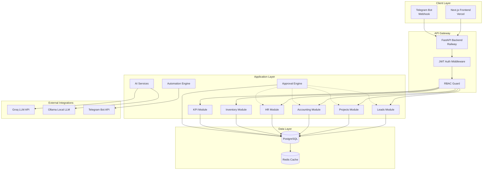
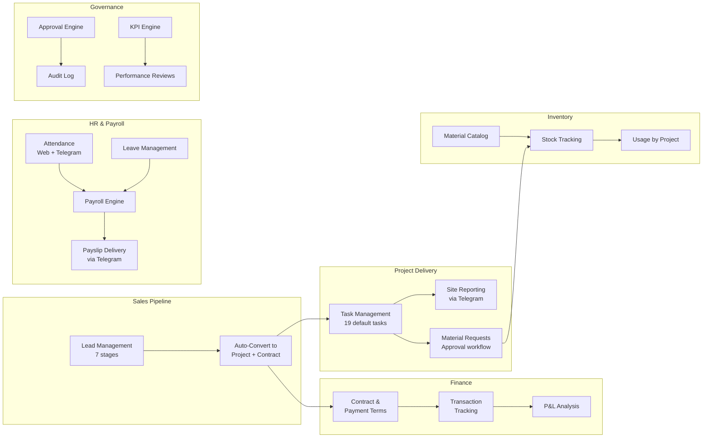
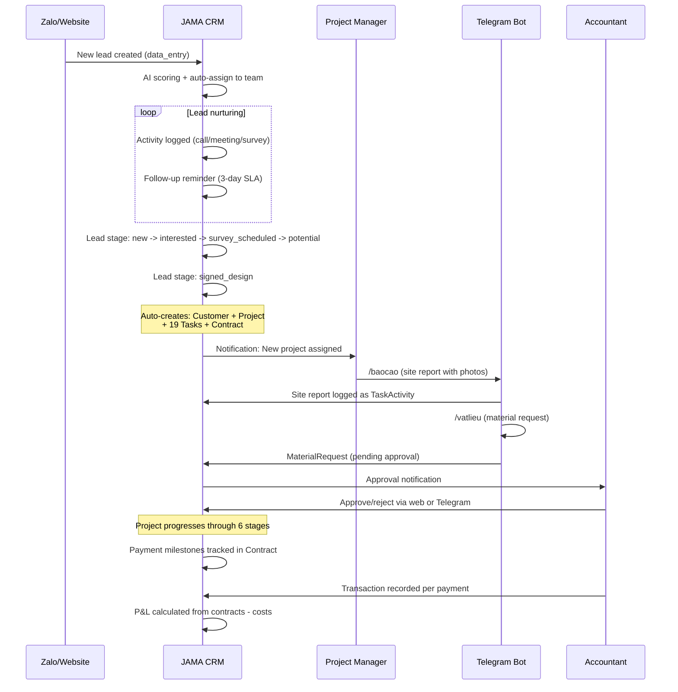
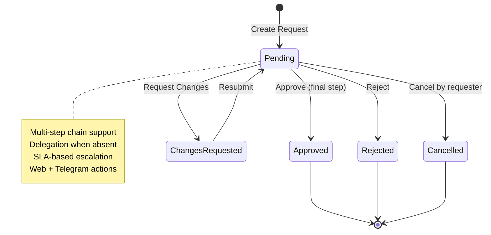
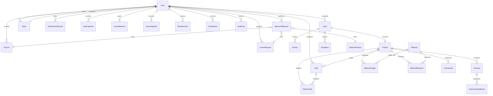
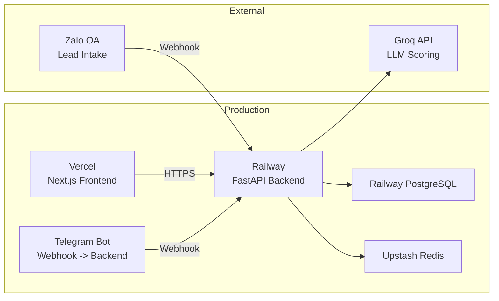

# System Architecture

> **Status**: Current state analysis as of July 2026
> **Last Updated**: 2026-07-16
> **Owner**: Product Team

---

## Overview

JAMA HOME CRM is a full-stack web application built for construction/interior design companies in Vietnam. It covers the entire business lifecycle from lead acquisition to project delivery, with integrated HR, payroll, inventory, and financial management.

---

## Technology Stack

| Layer | Technology | Purpose |
|-------|-----------|---------|
| Frontend | React + Next.js (TypeScript) | SPA with SSR, role-based routing |
| Backend | FastAPI (Python 3.11+) | Async REST API, webhook handling |
| Database | PostgreSQL (prod) / SQLite (dev) | Relational storage via SQLAlchemy async |
| ORM | SQLAlchemy 2.0 (async, mapped) | Models, migrations, queries |
| Auth | JWT (HS256) + RBAC | 8 roles, team-scoped access |
| Cache | Redis (optional) / in-memory | Dashboard, P&L, accounting summaries |
| AI/LLM | Groq (Llama 3.3) / Ollama fallback | Lead scoring, AI insights |
| Bot | Telegram Bot API | Field reports, check-in/out, approvals |
| Deployment | Railway (backend) + Vercel (frontend) | CI/CD, auto-deploy |

---

## Architecture Diagram



---

## Module Map



---

## Data Flow: Lead to Revenue



---

## Data Flow: Approval Engine



---

## API Router Inventory (27 routers)

| Router | Prefix | Purpose | Key RBAC |
|--------|--------|---------|----------|
| [[api-auth]] | `/api/v1/auth` | Login, Telegram auth | All users |
| [[api-leads]] | `/api/v1/leads` | CRUD, pipeline, kanban, CSV export | data_entry: own; leader: team; admin: all |
| [[api-projects]] | `/api/v1/projects` | CRUD, tasks, stage progression | PM/designer/sales: assigned; leader: all |
| [[api-dashboard]] | `/api/v1/dashboard` | Executive & personal dashboards | Role-specific view |
| [[api-accounting]] | `/api/v1/accounting` | Transactions, commissions, payroll listing | accountant/admin |
| [[api-pl]] | `/api/v1/pl` | P&L summary + per-project detail | admin/executive/accountant |
| [[api-hr]] | `/api/v1/hr` | Resignation, handover, undo-resign | admin/leader |
| [[api-kpi]] | `/api/v1/kpi` | KPI compute, leaderboard, coaching, reviews | Role-scoped |
| [[api-attendance]] | `/api/v1/attendance` | Check-in/out, team table, OT approval | All (personal); leader/admin (team) |
| [[api-approvals]] | `/api/v1/approvals` | Central approval hub, delegation | Approvers + delegated |
| [[api-leaves]] | `/api/v1/leaves` | Leave requests, balance, calendar | All (own); leader (team) |
| [[api-payroll]] | `/api/v1/payroll` | Generate, edit, submit, approve, pay | accountant (edit); admin (approve) |
| [[api-inventory]] | `/api/v1/inventory` | Materials, stock, usage tracking | admin/purchasing/accountant |
| [[api-telegram]] | `/api/v1/telegram` | Bot commands: reports, materials, incidents | Telegram-authenticated |
| [[api-automation]] | `/api/v1/automation` | Reminders, BOD reports, group briefing | admin/executive |
| [[api-notifications]] | `/api/v1/notifications` | In-app notification CRUD | All users |
| [[api-audit]] | `/api/v1/audit-logs` | Audit trail query | admin only |
| [[api-backup]] | `/api/v1/backup` | Database backup/restore | admin |
| [[api-users]] | `/api/v1/users` | User CRUD, team management | admin |
| [[api-customers]] | `/api/v1/customers` | Customer records | Various |
| [[api-contracts]] | `/api/v1/contracts` | Contract CRUD, payment terms | PM/leader/admin |
| [[api-quotations]] | `/api/v1/quotations` | Quotation management | PM/leader/designer/admin |
| [[api-instant-quote]] | `/api/v1/instant-quote` | AI-powered instant quoting | PM/leader/designer/admin |
| [[api-feedback]] | `/api/v1/feedback` | User feedback submission | All users |
| [[api-salary-grades]] | `/api/v1/salary-grades` | Salary grade management | admin/accountant |
| [[api-fixed-costs]] | `/api/v1/fixed-costs` | Fixed cost tracking | admin/accountant |
| [[api-variable-costs]] | `/api/v1/variable-costs` | Variable cost tracking | admin/accountant |
| [[api-commission-structures]] | `/api/v1/commission-structures` | Commission rules | admin/accountant |

---

## Database Model Map



---

## Security Architecture

### Authentication Flow
1. User logs in via email/password or Telegram bot
2. Backend validates credentials, returns JWT (480-minute expiry)
3. Frontend stores JWT in memory (not localStorage)
4. Every API request carries `Authorization: Bearer <jwt>`
5. Middleware validates JWT, resolves User, enforces RBAC

### RBAC Enforcement
- **Backend**: Middleware `get_current_user` + role checks in each router
- **Frontend**: `roles.ts` defines `ROLE_PERMISSIONS` per role; UI elements conditionally rendered
- **Team scoping**: Leaders see only their team's data; data_entry sees only own leads
- **Audit trail**: Every sensitive action logged with before/after snapshots

### Security Headers (applied globally)
```
X-Content-Type-Options: nosniff
X-Frame-Options: DENY
Referrer-Policy: strict-origin-when-cross-origin
X-XSS-Protection: 1; mode=block
CSP: default-src 'self'
HSTS: max-age=31536000 (HTTPS only)
```

---

## Deployment Topology


