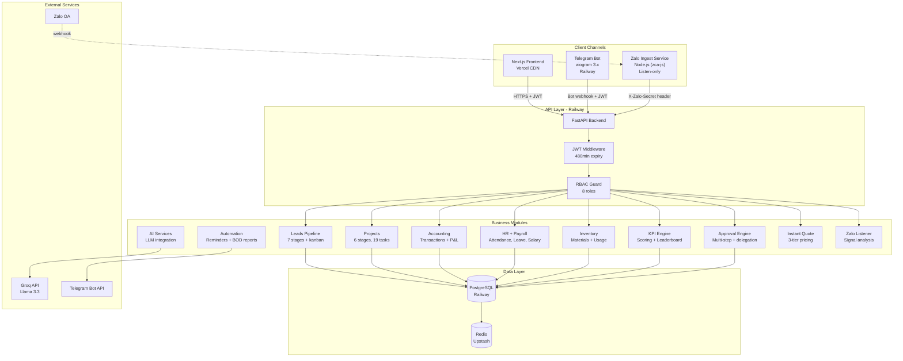
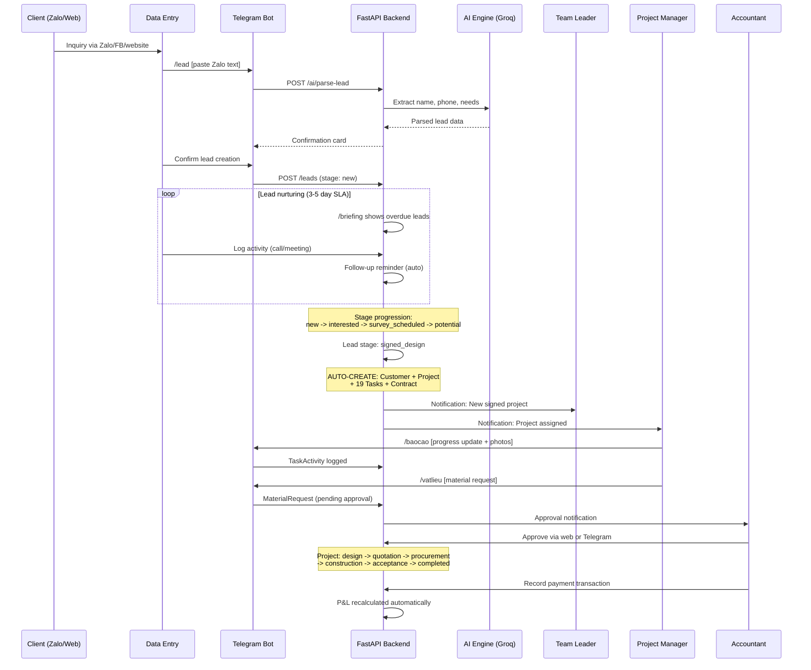
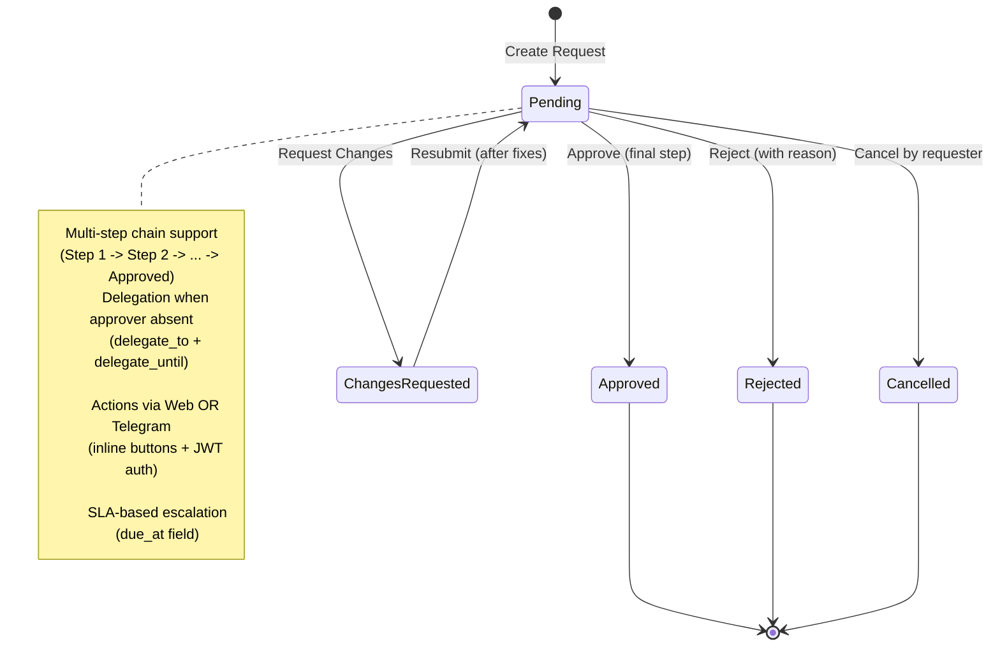
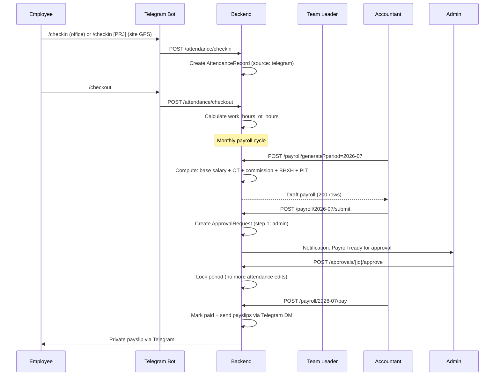
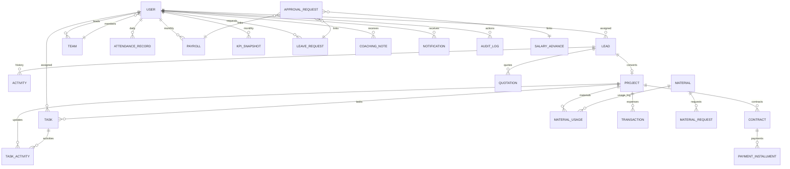
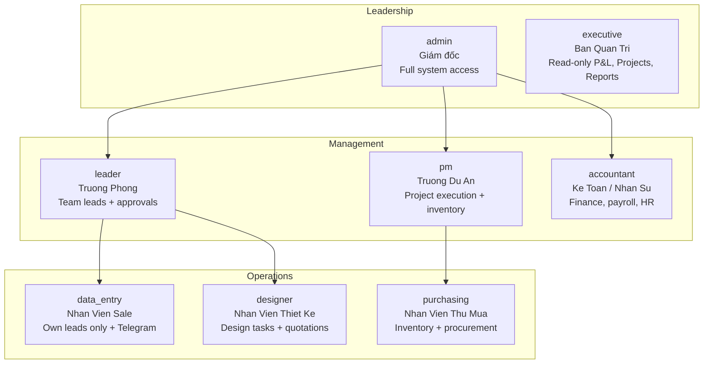
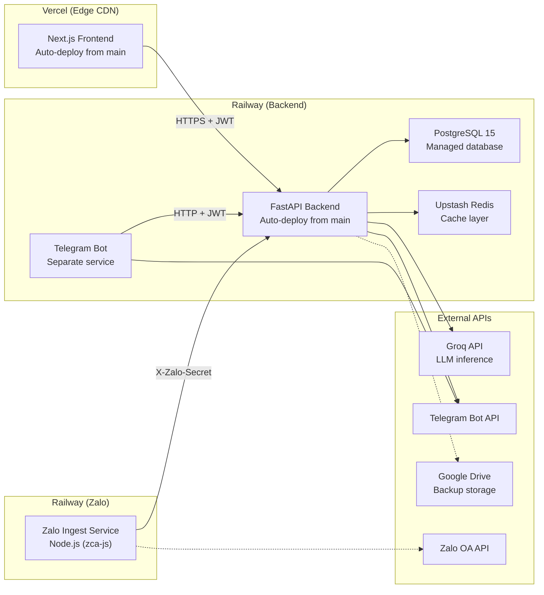

# System Architecture

> **Status**: Production  
> **Last Updated**: 2026-07-16  
> **Owner**: Product Team  
> **System**: JAMA HOME CRM v2.0

---

## 1. Executive Summary

JAMA HOME CRM is a full-stack, multi-channel business management platform built for Vietnamese construction and interior design companies. It manages the entire business lifecycle from lead acquisition through project delivery, with integrated HR, payroll, inventory, financial reporting, and field operations -- all accessible through both a web dashboard and a Telegram bot optimized for on-site workers.

**Key design principles:**
- **Telegram-first for field staff** -- sales and site workers operate primarily through Telegram; the web interface serves as the deep-work tool for office roles
- **Role-based everything** -- 8 distinct roles with scoped data visibility, from admin (full access) to data_entry (own leads only)
- **Audit everything** -- every sensitive mutation logged with before/after snapshots
- **Async-native** -- FastAPI + SQLAlchemy async for high-concurrency webhook processing

---

## 2. Technology Stack

| Layer | Technology | Purpose |
|-------|-----------|---------|
| Frontend | React + Next.js 14 (TypeScript) | SPA with SSR, role-based navigation, dark theme |
| Backend | FastAPI (Python 3.11+) | Async REST API, webhook handlers, background tasks |
| Database | PostgreSQL 15 (prod) / SQLite (dev) | Relational storage via SQLAlchemy 2.0 async |
| ORM | SQLAlchemy 2.0 (mapped columns) | Models, migrations, optimized aggregate queries |
| Auth | JWT (HS256, 480min expiry) + RBAC | 8 roles, team-scoped access, delegation |
| Cache | Redis (Upstash, optional) / in-memory | Dashboard, P&L, accounting summaries |
| AI/LLM | Groq (Llama 3.3) / Ollama fallback | Lead scoring, instant quoting, AI suggestions |
| Bot | Telegram Bot API (aiogram 3.x) | Field reports, check-in/out, approvals, lead intake |
| Zalo Listener | Node.js (zca-js) ingest service | Listen-only Zalo group monitoring |
| Deployment | Railway (backend + bot) + Vercel (frontend) | CI/CD, auto-deploy, edge CDN |
| Backup | pg_dump + optional Google Drive | Daily automated backups with retention |

---

## 3. High-Level Architecture

---

## 4. Component Deep Dive

### 4.1 Frontend (React + Next.js)

| Aspect | Detail |
|--------|--------|
| Hosting | Vercel (edge CDN, automatic deploys from `main`) |
| Framework | Next.js 14 App Router, React 18 |
| State | Server components + client hooks (`useAuth`, `api` singleton) |
| Theming | CSS variables, dark theme default + "Outdoor" high-contrast mode for sunlight readability |
| Search | Global `Cmd+K` search modal across all entities |
| Demo Mode | Full offline demo with mock data (`demo-data.ts`), toggle in sidebar |
| Role Nav | `Sidebar.tsx` -- max 5 essential items per role, expandable "Xem them" for the rest |

**Role-Based Navigation (Sidebar Essentials):**

| Role | Essential Nav Items | Main Route (prefetch) |
|------|--------------------|-----------------------|
| admin | Dashboard, Approvals, Leads, Projects, P&L | `/leads` |
| executive | Dashboard, P&L, Projects, Reports | `/pl` |
| leader | Dashboard, Approvals, Leads, KPI, Attendance | `/leads` |
| data_entry | Dashboard, Leads, Instant Quote, Attendance, KPI | `/leads` |
| designer | Dashboard, Projects, Quotations, Attendance | `/projects` |
| pm | Dashboard, Projects, Approvals, Inventory, Attendance | `/projects` |
| accountant | Dashboard, Accounting, Attendance, Approvals, P&L | `/accounting` |
| purchasing | Dashboard, Inventory, Projects, Attendance | `/inventory` |

### 4.2 Backend (FastAPI)

| Aspect | Detail |
|--------|--------|
| Hosting | Railway (auto-deploy from `main`) |
| Database | PostgreSQL 15 via `asyncpg` driver |
| ORM | SQLAlchemy 2.0 with `Mapped` type annotations |
| Auth | JWT tokens (HS256), 480-minute expiry, `get_current_user` dependency |
| Caching | Redis (Upstash) with prefix-based invalidation; in-memory fallback |
| API prefix | `/api/v1/` -- 27+ routers |

**Key Backend Patterns:**
- **Aggregate queries over N+1**: Team attendance, project progress, pipeline stats all use single aggregate SQL instead of per-entity queries
- **Cache invalidation**: Dashboard, P&L, and accounting caches cleared on write operations via `cache.clear_prefix()`
- **Audit logging**: `log_action()` called on every sensitive mutation with before/after snapshots
- **Rate limiting**: Public instant-quote endpoint uses in-memory IP-based rate limiting (5 req/hour)

### 4.3 Telegram Bot

| Aspect | Detail |
|--------|--------|
| Hosting | Railway (separate service, same backend) |
| Framework | aiogram 3.x with FSM (finite state machines) |
| Auth | Telegram user ID mapped to CRM user via `telegram_user_id` field |
| Health check | Built-in HTTP server on `PORT` for Railway healthcheck |

**Available Telegram Commands:**

| Command | Description | Primary Users |
|---------|-------------|---------------|
| `/start` | Login/authenticate with CRM | All |
| `/briefing` | Personal daily briefing (leads, overdue, AI suggestions) | Sales, Leaders |
| `/pipeline` | Visual pipeline kanban + stats | Sales, Leaders |
| `/lead` | Intake new lead from Zalo text (AI-parsed) | Data entry |
| `/duan` | Project lookup by code | PM, Designer, Purchasing |
| `/baocao` | Site report with photo upload | PM, Designer |
| `/vatlieu` | Material purchase request | PM, Purchasing |
| `/suco` | Incident report with photo evidence | PM, Designer |
| `/checkin` | GPS check-in (office or project site) | All |
| `/checkout` | GPS check-out | All |
| `/feedback` | Submit feedback/suggestion | All |
| `/approve` | Inline approve/reject callbacks | Leaders, Admin |
| `/id` | Show group chat ID | Admin |

### 4.4 Zalo Listener

| Aspect | Detail |
|--------|--------|
| Architecture | Separate Node.js service (zca-js), listen-only |
| Communication | Pushes QR codes, heartbeats, and messages to FastAPI backend |
| Auth | Shared secret via `X-Zalo-Secret` header |
| Privacy | Consent reference stored per group; no outbound messages to Zalo |
| Signal types | `lead_candidate`, `commitment`, `quote_request`, `unanswered`, `deal_risk`, `faq` |

---

## 5. Data Flow Diagrams

### 5.1 Lead-to-Invoice Pipeline

### 5.2 Approval Workflow

### 5.3 Attendance + Payroll Lifecycle

---

## 6. Database Architecture

### 6.1 Entity Relationship Overview

### 6.2 Key Tables

| Table | Records (est.) | Purpose |
|-------|----------------|---------|
| `users` | 200 | Employee accounts with role, department, team, Telegram mapping |
| `teams` | 10+ | Organizational teams with department and leader |
| `leads` | 2,000+ | CRM leads with 7-stage pipeline, source, classification |
| `activities` | 15,000+ | Lead interaction history (call, meeting, stage_change) |
| `projects` | 200+ | Active projects with 6-stage delivery pipeline |
| `tasks` | 3,800+ | 19 default tasks per project, with status and assignments |
| `task_activities` | 10,000+ | Site reports, material updates, photo evidence |
| `contracts` | 200+ | Revenue contracts with 4-installment payment terms |
| `quotations` | 500+ | Design and construction quotations with revision tracking |
| `attendance_records` | 10,000+ | Daily check-in/out with source, OT hours, GPS |
| `payroll` | 4,000+ | Monthly salary calculations with Vietnamese tax compliance |
| `commissions` | 1,000+ | Sales commissions tied to project milestones |
| `approval_requests` | 3,000+ | Multi-step approval chains with delegation support |
| `materials` | 500+ | Material catalog with stock levels and min-stock alerts |
| `material_usages` | 2,000+ | Material consumption linked to projects |
| `notifications` | 20,000+ | In-app + Telegram push notifications |
| `audit_logs` | 30,000+ | Full audit trail with before/after snapshots |
| `kpi_snapshots` | 1,500+ | Monthly KPI computations and rankings |
| `zalo_messages` | 5,000+ | Ingested Zalo messages for signal analysis |
| `zalo_signals` | 500+ | Detected lead candidates, quote requests, risks |
| `price_items` | 100+ | Instant quote pricing catalog (basic/standard/premium) |

---

## 7. RBAC Architecture

### 7.1 Role Hierarchy

### 7.2 Permission Matrix

| Capability | admin | executive | leader | data_entry | accountant | pm | designer | purchasing |
|------------|:-----:|:---------:|:------:|:----------:|:----------:|:--:|:--------:|:----------:|
| View all leads | Y | - | team | own | - | - | - | - |
| Create/edit leads | Y | - | team | own | - | - | - | - |
| Assign leads | Y | - | Y | - | - | - | - | - |
| View projects | Y | Y | Y | Y | Y | Y | assigned | Y |
| Create projects | Y | Y | Y | - | - | Y | - | - |
| Create/edit tasks | Y | - | Y | - | - | Y | own | - |
| View accounting | Y | - | Y | Y | Y | - | - | - |
| View P&L | Y | Y | - | - | Y | - | - | - |
| Manage payroll | Y | - | - | - | Y | - | - | - |
| Approve requests | Y | - | Y | - | Y | Y | - | Y |
| Manage inventory | Y | - | - | - | Y | Y | - | Y |
| Manage users | Y | - | - | - | Y | - | - | - |
| View KPI | Y | Y | Y | Y | - | Y | Y | Y |
| Attendance (own) | Y | Y | Y | Y | Y | Y | Y | Y |
| Attendance (team) | Y | - | Y | - | Y | - | - | - |

---

## 8. Infrastructure

### 8.1 Deployment Topology

### 8.2 Environment Variables

| Variable | Service | Purpose |
|----------|---------|---------|
| `DATABASE_URL` | Backend | PostgreSQL connection string |
| `SECRET_KEY` | Backend | JWT signing key |
| `GROQ_API_KEY` | Backend | LLM API key for AI features |
| `OLLAMA_BASE_URL` | Backend | Fallback LLM endpoint |
| `TELEGRAM_BOT_TOKEN` | Bot | Telegram bot authentication |
| `ZALO_INGEST_SECRET` | Backend + Zalo | Shared secret for ingest service |
| `REDIS_URL` | Backend | Redis connection (optional) |
| `BACKUP_GDRIVE_*` | Backend | Google Drive backup credentials |

### 8.3 Security Architecture

| Control | Implementation |
|---------|---------------|
| Authentication | JWT (HS256, 480-min expiry), stored in memory (not localStorage) |
| Authorization | 8-role RBAC enforced in both backend middleware and frontend UI |
| Team scoping | Leaders see only their team; data_entry sees only own leads |
| Audit trail | Every mutation logged with actor, before/after, timestamp |
| API security | Security headers (CSP, HSTS, X-Frame-Options) applied globally |
| Telegram auth | User ID mapped to CRM account; inline callbacks verified via JWT |
| Zalo security | Shared secret header; listen-only (no outbound Zalo messages) |
| Backup | Automated pg_dump with configurable retention + Google Drive upload |
| Period lock | Payroll approval locks the attendance period, preventing edits |

---

## 9. Automation & Background Jobs

| Job | Trigger | Action |
|-----|---------|--------|
| Follow-up Reminder | Scheduled (configurable days) | Notify sales about leads not contacted within SLA |
| Lead Recall | Scheduled (configurable days) | Reassign overdue leads to less-loaded sales reps |
| Payment Reminder | Scheduled | Notify about pending contract payment milestones |
| BOD Report | Daily/weekly/monthly (configurable hour) | Generate and push executive summary to Telegram group |
| Group Briefing | Manual or scheduled | Team performance summary to Telegram group chat |
| Payroll Generation | Manual (accountant) | Calculate monthly salary for all active employees |
| Payroll Payment | Manual (accountant) | Mark paid + send private payslips via Telegram DM |

---

## 10. Scalability Considerations

| Dimension | Current | Growth Path |
|-----------|---------|-------------|
| Users | 200 employees | Add read replicas, connection pooling (PgBouncer) |
| Leads | ~2,000 | Already indexed; add partitioning if >100K |
| API traffic | Moderate (web + bot) | Redis caching already in place; add rate limiting |
| File storage | Telegram photos (CDN) | Migrate to S3-compatible storage |
| Multi-tenant | Single tenant | Schema-per-tenant or row-level security (see Whitelabel Strategy) |

---

## Related Documentation

- [[04-Real-World-Usecases]] -- Daily workflows for every role
- [[05-Mermaid-Diagrams]] -- All system diagrams in one place
- [[06-Whitelabel-Strategy]] -- Multi-tenant and industry expansion plans
