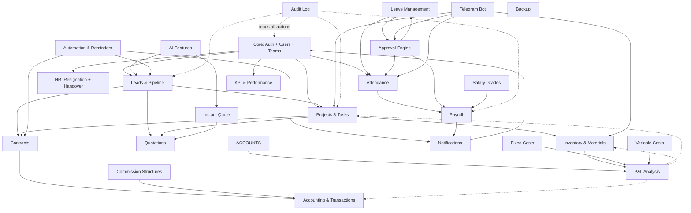

# Module Dependency Map

> **Last Updated**: 2026-07-16
> **Purpose**: Understand which modules depend on each other for whitelabel feature toggling and multi-tenant provisioning.

---

## Dependency Graph

---

## Module Tiers (for Feature Gating)

### Tier 1: Core (Required)
These modules are foundational -- everything else depends on them.

| Module | Routers | Tables | Notes |
|--------|---------|--------|-------|
| Auth & Users | `auth`, `users` | `users`, `teams` | Login, JWT, team structure |
| Notifications | `notifications` | `notifications`, `system_settings` | In-app alerts, config store |
| Audit | `audit` | `audit_logs` | Compliance trail |

### Tier 2: Sales (Leads OR Projects)
Either leads or projects can exist independently, but the full pipeline connects them.

| Module | Depends On | Enables | Tables |
|--------|-----------|---------|--------|
| Leads & Pipeline | Core | Contracts, Projects, Quotations | `leads`, `activities` |
| Projects & Tasks | Core | Contracts, Quotations, Inventory | `projects`, `tasks`, `task_activities` |
| Customers | Core | Linked to Leads and Projects | `customers` |

### Tier 3: Revenue
| Module | Depends On | Enables |
|--------|-----------|---------|
| Contracts | Leads or Projects | Accounting, P&L |
| Quotations | Leads or Projects | Contracts |
| Instant Quote | AI + Quotations | Quotations |

### Tier 4: Operations
| Module | Depends On | Enables |
|--------|-----------|---------|
| Inventory | Core | P&L, Material requests |
| Approval Engine | Core | Leave, Payroll, Material requests |
| Telegram Bot | Core + Attendance + Inventory + Projects + Approvals | Field operations |

### Tier 5: Finance
| Module | Depends On | Enables |
|--------|-----------|---------|
| Accounting | Core + Contracts | P&L |
| Salary Grades | Core | Payroll |
| Fixed Costs | Core | P&L |
| Variable Costs | Core | P&L |
| Commission Structures | Core | Accounting |
| P&L Analysis | Accounting + Projects + Inventory | Executive decisions |

### Tier 6: People
| Module | Depends On | Enables |
|--------|-----------|---------|
| Attendance | Core | Payroll, Leave |
| Leave Management | Core + Attendance + Approval Engine | Payroll |
| HR (Resignation) | Core + Leads + Projects | Employee lifecycle |
| Payroll | Attendance + Salary Grades + Approval Engine | Payslips via Telegram |
| KPI & Performance | Core + Leads + Projects + Attendance | Performance reviews |

### Tier 7: Intelligence
| Module | Depends On | Enables |
|--------|-----------|---------|
| AI Features | Core + Leads | Lead scoring, insights |
| Automation | Core + Leads + Contracts + Notifications | BOD reports, reminders |

---

## Minimum Viable Configurations

### Config A: Sales-Only CRM (Small agency)
**Modules**: Auth + Leads + Notifications + Audit
**Use case**: Real estate agency, sales team tracking leads
**Users**: 5-20

### Config B: Project Delivery (Mid-size contractor)
**Modules**: Auth + Projects + Tasks + Telegram + Attendance + Notifications + Audit
**Use case**: Construction company focused on project tracking
**Users**: 20-100

### Config C: Full Business Platform (Current JAMA)
**Modules**: All 13 modules enabled
**Use case**: Integrated construction/design company
**Users**: 50-200

### Config D: HR & Payroll Focus (HR consultancy)
**Modules**: Auth + Attendance + Leave + Payroll + Salary Grades + Approvals + Notifications + Audit
**Use case**: Company needing HR automation without full CRM
**Users**: 50-500
