# Entity Relationship Diagram — JAMA HOME CRM

## Complete ERD

```mermaid
erDiagram
    %% ===== User & Organization =====
    Team {
        uuid id PK
        string name
        string code UK
        string department "EXEC|SALES|DESIGN|PM|ACCT"
        uuid leader_id FK "→ users.id"
        datetime created_at
    }

    User {
        uuid id PK
        string full_name
        string email UK
        string phone
        string password_hash
        string role "admin|executive|leader|data_entry|accountant|purchasing|designer|pm"
        string department
        uuid team_id FK "→ teams.id"
        bigint telegram_user_id UK
        string telegram_username
        bool is_active
        uuid salary_grade_id FK
        int dependents_count
        uuid delegate_to "ủy quyền duyệt"
        datetime delegate_until
        datetime resign_date
        uuid resigned_by
        datetime created_at
        datetime updated_at
    }

    Team ||--o{ User : "members"
    Team }o--o| User : "leader"

    %% ===== Salary & Grade =====
    SalaryGrade {
        uuid id PK
        string grade_name
        float base_salary
        float bhxh_rate "BHXH NLĐ %"
        float bhxh_company_rate "BHXH NSDLĐ %"
        float bhyt_rate "BHYT %"
        float bhtn_rate "BHTN %"
        date effective_date
    }

    SalaryGrade ||--o{ User : "assigned to"

    %% ===== CRM Pipeline =====
    Lead {
        uuid id PK
        string name
        string phone
        string email
        string contact_person
        string address
        text needs
        string source "facebook|zalo|website|referral|tiktok|other"
        string channel "kenh_a|kenh_b|kenh_chinh|kenh_sale|kenh_affiliate|khac"
        string property_type "townhouse|apartment|villa|office|shophouse|other"
        float area_sqm
        float estimated_budget
        string contact_status "reachable|unreachable|wrong_number|no_need|pending"
        datetime survey_date
        text survey_photos
        string property_class "luxury|mid_range|budget"
        float price_per_sqm
        string region
        string segment
        string plan_type "online|offline|survey|none"
        text tags "JSON array"
        float deal_value
        string stage "new|interested|survey_scheduled|potential|signed_design|lost|dormant"
        string priority "low|medium|high|urgent"
        uuid assigned_to FK
        uuid team_id FK
        float ai_score
        text ai_notes
        float design_contract_value
        datetime last_contacted_at
    }

    Activity {
        uuid id PK
        uuid lead_id FK
        uuid user_id FK
        string type "call|email|meeting|survey|note|stage_change|assignment"
        text content
        bigint telegram_message_id
        bigint telegram_chat_id
    }

    Lead ||--o{ Activity : "activities"
    User ||--o{ Activity : "performed"
    User ||--o{ Lead : "assigned_to"
    Team ||--o{ Lead : "team"

    %% ===== Customer =====
    Customer {
        uuid id PK
        string name
        string phone
        string email
        string address
        string type "individual|company"
        string tax_code
        string company_name
        uuid lead_id FK "origin lead"
    }

    Lead ||--o| Customer : "converts to"

    %% ===== Quotation & Contract =====
    Quotation {
        uuid id PK
        string code UK
        string type "design|construction"
        uuid project_id FK
        uuid lead_id FK
        string title
        string status "draft|approved|sent|rejected|expired"
        float total_amount
        float tax_amount
        date valid_until
        json items "line items"
        int revision
        uuid created_by FK
        string erp_quotation_id
    }

    Contract {
        uuid id PK
        string code UK
        uuid project_id FK
        uuid quotation_id FK
        string title
        string status "draft|approved|sent|signed|completed|cancelled"
        float total_value
        json payment_terms "4 đợt 25%"
        date signed_date
        int working_days
        date start_date
        string erp_contract_id
    }

    Lead ||--o{ Quotation : "quotes"
    Quotation ||--o| Contract : "generates"

    %% ===== Project =====
    Project {
        uuid id PK
        string code UK
        string name
        uuid lead_id FK
        uuid customer_id FK
        string client_name
        string client_phone
        string address
        string project_type "design_only|design_build|construction_only"
        string status "active|paused|completed|cancelled"
        string stage "design|quotation|procurement|construction|acceptance|completed"
        float design_value
        float construction_value
        float total_value
        float spent
        int progress "0-100"
        uuid pm_id FK
        uuid designer_id FK
        uuid sales_id FK
        date start_date
        date target_end_date
    }

    Task {
        uuid id PK
        uuid project_id FK
        string title
        text description
        string status "not_started|in_progress|done"
        string stage "design|quotation|procurement|construction|acceptance"
        string department
        string final_file_url
        uuid assigned_to FK
        int order
        date due_date
        datetime completed_at
    }

    TaskActivity {
        uuid id PK
        uuid task_id FK
        uuid user_id FK
        text content
        string media_url
    }

    Project ||--o{ Task : "tasks"
    Task ||--o{ TaskActivity : "activities"
    Project }o--o| Lead : "origin lead"
    Project }o--o| Customer : "client"
    Contract }o--|| Project : "for project"

    %% ===== Attendance & Leave =====
    AttendanceRecord {
        uuid id PK
        uuid user_id FK
        date work_date
        datetime check_in
        datetime check_out
        float check_in_lat
        float check_in_lng
        uuid project_id FK "on-site"
        string source "web|telegram|leave|auto"
        float work_hours
        float ot_hours
        string ot_status "none|pending|approved|rejected"
        bool needs_review
        string note
    }

    LeaveBalance {
        uuid id PK
        uuid user_id FK
        int year
        float annual_total "12 days/năm"
        float annual_used
        float sick_used
        float unpaid_used
    }

    LeaveRequest {
        uuid id PK
        uuid user_id FK
        string leave_type "annual|sick|unpaid"
        date start_date
        date end_date
        float days "supports 0.5"
        string reason
        string status "pending|approved|rejected|cancelled"
        uuid approval_id "→ approval_requests"
    }

    User ||--o{ AttendanceRecord : "checks in"
    User ||--o{ LeaveBalance : "balance"
    User ||--o{ LeaveRequest : "requests"

    %% ===== Approval =====
    ApprovalRequest {
        uuid id PK
        string type "leave|advance|payroll_period|expense|overtime"
        string ref_id "FK to source record"
        string title
        float amount
        uuid requester_id FK
        uuid current_approver_id FK
        string next_approvers_csv "CSV user_ids"
        int step
        int total_steps
        string status "pending|approved|rejected|changes_requested|cancelled"
        string reason
        string acted_via "web|telegram"
        datetime due_at
        int escalated
        datetime resolved_at
    }

    User ||--o{ ApprovalRequest : "requests"
    User ||--o{ ApprovalRequest : "approves"

    %% ===== Finance =====
    Transaction {
        uuid id PK
        string code
        string type "income|expense"
        string category "design_contract|construction_contract|material|labor|commission|salary|other"
        string description
        float amount
        uuid project_id FK
        uuid lead_id FK
        uuid created_by FK
        string status "pending|completed|cancelled"
        datetime date
    }

    Commission {
        uuid id PK
        uuid user_id FK
        uuid project_id FK
        uuid lead_id FK
        string type "design_commission|construction_commission|leader_override"
        float rate
        float base_amount
        float commission_amount
        string milestone "signing|rough_complete|handover"
        float milestone_pct
        string status "pending|approved|paid"
        string period "YYYY-MM"
    }

    FixedCost {
        uuid id PK
        string category
        float amount
        string month "YYYY-MM"
        text notes
        uuid created_by
    }

    VariableCost {
        uuid id PK
        string category
        float amount
        uuid project_id
        string month "YYYY-MM"
        text notes
        uuid created_by
    }

    CommissionStructure {
        uuid id PK
        string department
        string commission_type
        float rate
        date effective_date
    }

    User ||--o{ Commission : "earns"
    Project ||--o{ Transaction : "transactions"
    Project ||--o{ Commission : "commissions"

    %% ===== Payroll =====
    Payroll {
        uuid id PK
        uuid user_id FK
        string period "YYYY-MM"
        float base_salary
        float commission_total
        float bonus
        float deductions
        float net_salary
        float work_days
        float standard_days "22"
        float ot_hours
        float ot_pay
        float allowance
        float bhxh_employee
        float bhxh_company
        float pit "thuế TNCN"
        float taxable_income
        float advance_deduction
        float gross_salary
        uuid salary_grade_id
        uuid approved_by
        datetime paid_at
        datetime payslip_sent_at
        string status "draft|pending_approval|approved|paid"
    }

    SalaryAdvance {
        uuid id PK
        uuid user_id FK
        float amount
        string reason
        string status "pending|approved|deducted|rejected|cancelled"
        uuid approval_id
        string period_deducted "YYYY-MM"
        datetime resolved_at
    }

    User ||--o{ Payroll : "payslips"
    User ||--o{ SalaryAdvance : "advances"

    %% ===== Inventory =====
    Material {
        uuid id PK
        string code UK
        string name
        string category "wood|stone|metal|paint|electrical|plumbing|furniture|fabric|glass|general"
        string unit "cái|m2|m|kg|tấm|bộ|cuộn|hộp|lít"
        float unit_price
        float quantity_in_stock
        float min_stock
        string supplier
    }

    MaterialUsage {
        uuid id PK
        uuid material_id FK
        uuid project_id FK
        float quantity
        float unit_price_at_use
        float total_cost
        datetime date
        uuid created_by FK
    }

    Material ||--o{ MaterialUsage : "usages"
    Project ||--o{ MaterialUsage : "consumes"

    %% ===== Pricing =====
    PriceItem {
        uuid id PK
        string code UK "e.g. TRAN-01"
        string name
        string category "tran_vach|san|son_giay|tu_bep|tu_ao_go|sofa_ban_ghe|giuong_nem|den_dien|rem_trang_tri|thiet_bi|khac"
        string unit "m2|md|bo|cai|tron_goi"
        float price_basic
        float price_standard
        float price_premium
        bool is_active
    }

    %% ===== KPI & Performance =====
    KpiSnapshot {
        uuid id PK
        uuid user_id FK
        string period "YYYY-MM"
        text metrics_json "8 metrics"
        float score "0-100"
        int rank_in_team
        int rank_overall
    }

    CoachingNote {
        uuid id PK
        uuid user_id FK
        uuid coach_id FK
        text note
        string kind "one_on_one|praise|concern|plan"
    }

    ReviewCycle {
        uuid id PK
        uuid user_id FK
        string period "YYYY-Qn"
        text self_json
        text leader_json
        text goals_json
        string status "pending_self|pending_leader|done"
        string suggested_grade_change
    }

    User ||--o{ KpiSnapshot : "snapshots"
    User ||--o{ CoachingNote : "receives"
    User ||--o{ CoachingNote : "coaches"
    User ||--o{ ReviewCycle : "reviews"

    %% ===== Zalo =====
    ZaloSession {
        string id PK "default (singleton)"
        string status "logged_out|awaiting_qr|qr_ready|logged_in|error"
        text qr_image "base64 data URI"
        string account_name
        string error_msg
        bool login_requested
        datetime last_seen
    }

    ZaloGroup {
        uuid id PK
        string zalo_group_id UK
        string name
        string kind "internal|customer"
        uuid assigned_user_id FK
        bool monitoring
        string consent_ref
    }

    ZaloMessage {
        uuid id PK
        uuid group_id FK
        string sender_zalo_id
        string sender_name
        text text
        string media_ref
    }

    ZaloSignal {
        uuid id PK
        uuid group_id FK
        string source_msg_id
        string type "lead_candidate|commitment|quote_request|unanswered|deal_risk|faq"
        string summary
        text payload_json
        string status "new|actioned|dismissed"
        uuid assigned_user_id FK
        datetime resolved_at
    }

    ZaloGroup ||--o{ ZaloMessage : "messages"
    ZaloGroup ||--o{ ZaloSignal : "signals"

    %% ===== Notifications & System =====
    Notification {
        uuid id PK
        uuid user_id FK
        string type "followup_reminder|lead_recalled|lead_assigned|payment_reminder|contract_signed|bod_report|system"
        string title
        text body
        string link "frontend route"
        string ref_id "dedupe key"
        bool read
    }

    SystemSetting {
        string key PK
        string value
    }

    Feedback {
        uuid id PK
        uuid user_id
        bigint telegram_user_id
        string category "bug|feature_request|workflow_improvement|other"
        text content
        string status "new|reviewed|resolved"
        text admin_reply
    }

    AuditLog {
        uuid id PK
        uuid actor_id
        string actor_name "snapshot"
        string action "user.create|payroll.approve|..."
        string entity_type "user|payroll|attendance|..."
        uuid entity_id
        text before_json
        text after_json
        string note
    }

    User ||--o{ Notification : "notifications"
```

## Entity Count Summary

| Domain | Tables | Key Relationships |
|--------|--------|------------------|
| User & Org | 2 | Team ↔ User (1:N), User → SalaryGrade |
| CRM | 4 | Lead → Activity, Lead → Customer, Lead → Quotation → Contract |
| Projects | 3 | Project → Task → TaskActivity |
| HR & Attendance | 3 | User → AttendanceRecord, LeaveBalance, LeaveRequest |
| Approval | 1 | ApprovalRequest (shared for leave/advance/payroll/expense/OT) |
| Finance | 6 | Transaction, Commission, Payroll, SalaryAdvance, FixedCost, VariableCost |
| Inventory | 2 | Material → MaterialUsage |
| KPI & Performance | 3 | KpiSnapshot, CoachingNote, ReviewCycle |
| Zalo | 4 | ZaloSession, ZaloGroup → ZaloMessage → ZaloSignal |
| System | 4 | Notification, SystemSetting, Feedback, AuditLog |
| Pricing | 1 | PriceItem (instant quote catalog) |
| Commission | 1 | CommissionStructure |
| **Total** | **34 tables** | |

## Key Indexes

| Table | Index | Purpose |
|-------|-------|---------|
| leads | assigned_to + stage | Pipeline view per user |
| leads | stage + created_at | Pipeline timeline |
| attendance_records | user_id + work_date (UNIQUE) | 1 record per user per day |
| approval_requests | current_approver_id + status | Pending approvals dashboard |
| kpi_snapshots | user_id + period (UNIQUE) | 1 snapshot per user per period |
| payrolls | user_id + period (UNIQUE) | 1 payslip per user per period |
| zalo_messages | group_id + created_at | Message timeline |
| zalo_signals | status + created_at | Signal triage queue |
| notifications | user_id + read + created_at | Unread notification count |

## Tags

#erd #database #schema #jama-home
