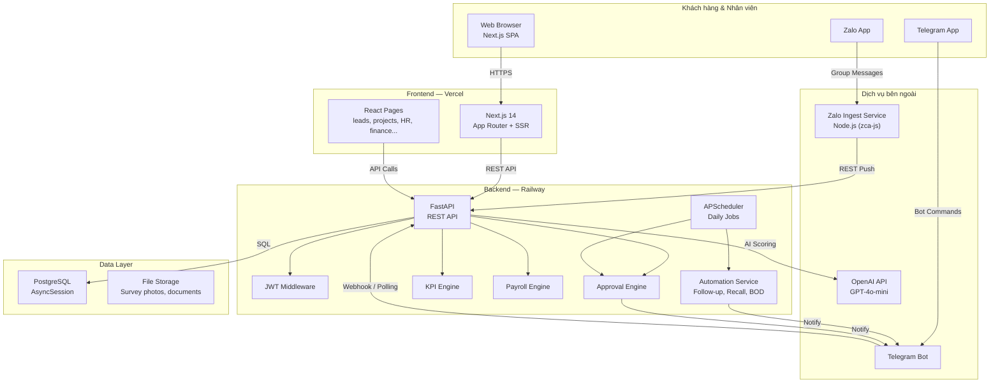
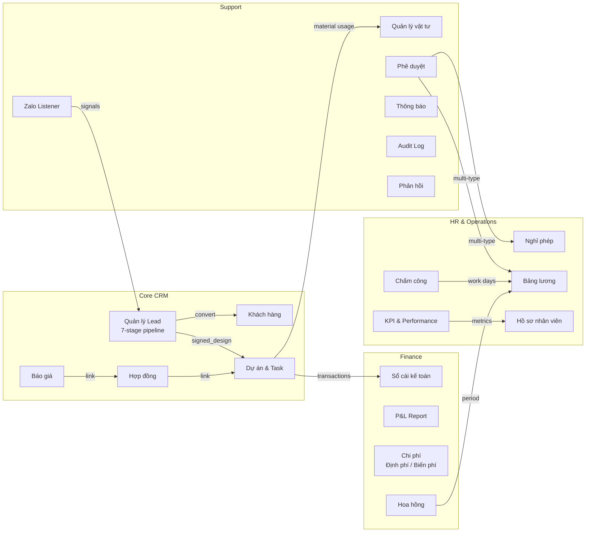
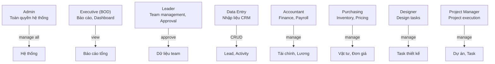

# System Architecture — JAMA HOME CRM

## Overview

JAMA HOME CRM is a full-stack enterprise application for a Vietnamese interior design company with ~200 employees across 8 roles. The system manages the complete business lifecycle: lead capture, design quotation, construction project management, HR/payroll, inventory, and financial reporting.

## Tech Stack

| Layer | Technology |
|-------|-----------|
| Frontend | Next.js 14 (App Router), React, TailwindCSS, shadcn/ui |
| Backend | FastAPI (Python 3.11+), async SQLAlchemy 2.0 |
| Database | PostgreSQL (production), SQLite (development) |
| Auth | JWT (access tokens), bcrypt password hashing |
| Messaging | Telegram Bot API (notifications, approvals, daily briefings) |
| Zalo Integration | Node.js ingest service (zca-js) + REST bridge |
| Deployment | Railway (backend + PostgreSQL), Vercel (frontend) |
| AI | OpenAI GPT-4o-mini (lead scoring, instant quotes) |

## High-Level Architecture Diagram

## Module Map

## Role-Based Access Control (RBAC)

## Departments

| Code | Department | Vietnamese |
|------|-----------|------------|
| EXEC | Executive | Ban Giám đốc |
| SALES | Sales | Phòng Kinh doanh |
| DESIGN | Design | Phòng Thiết kế |
| PM | Project Management | Phòng Quản lý Dự án |
| ACCT | Accounting | Phòng Kế toán |

## Data Flow Patterns

### Synchronous (Request-Response)
- Web API calls: CRUD operations, search, dashboard queries
- Auth: login, token refresh

### Asynchronous (Event-Driven)
- Approval side-effects: when approval completes, triggers leave/payroll updates
- Notifications: in-app + Telegram push on events
- AI scoring: non-blocking lead scoring on create/update

### Scheduled (Cron Jobs)
- **07:00 VN**: BOD daily report, follow-up reminders, group briefing
- **Midnight VN**: Auto-close open attendance shifts, Zalo message cleanup (>7 days), approval escalation check
- **Monthly**: KPI snapshot generation, payroll period lock

## Key Design Decisions

1. **Approval Engine as shared service**: Single `ApprovalRequest` table handles leave, advance, payroll, expense, and overtime approvals with pluggable side-effects via `register_side_effect()`.
2. **1 record/user/day attendance**: Check-in creates, subsequent check-ins update check-out only. Prevents duplicate records.
3. **KPI uses aggregate SQL**: No per-lead loops for 200+ employees (performance critical).
4. **Zalo Signal vs Message**: Raw messages are temporary (7-day retention), signals are permanent assets.
5. **Delegate approval**: Users can set `delegate_to` + `delegate_until` for approval proxy when absent.
6. **Audit trail**: All sensitive operations (salary, role changes, approvals) logged to `audit_logs`.

## Tags

#architecture #system-design #jama-home
