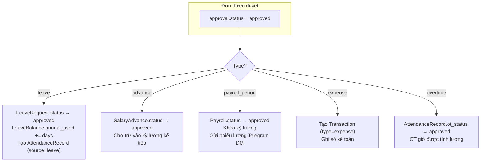
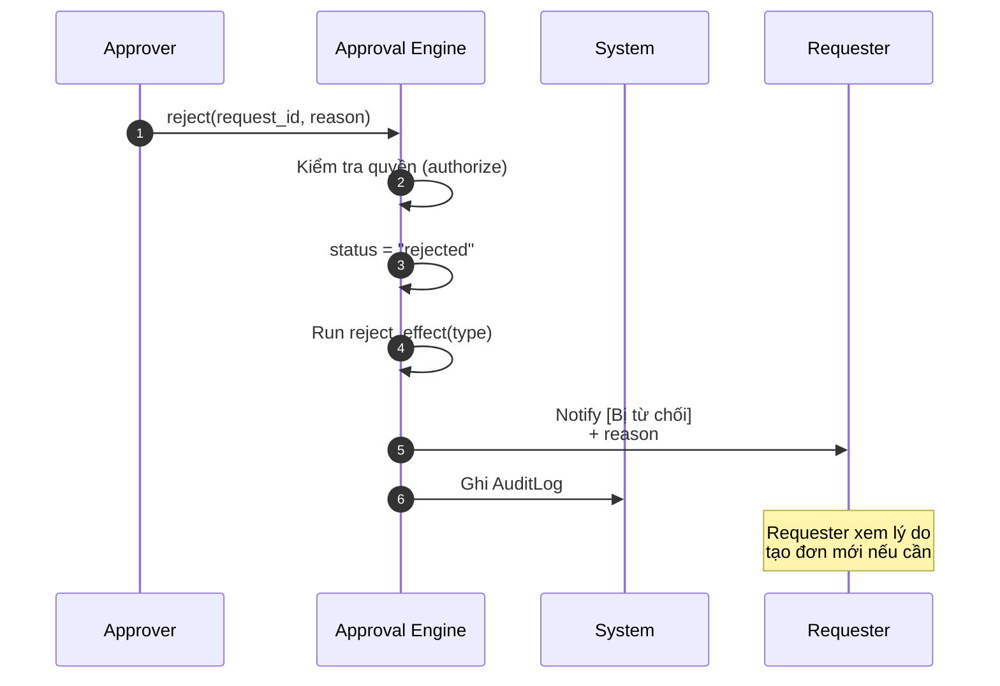
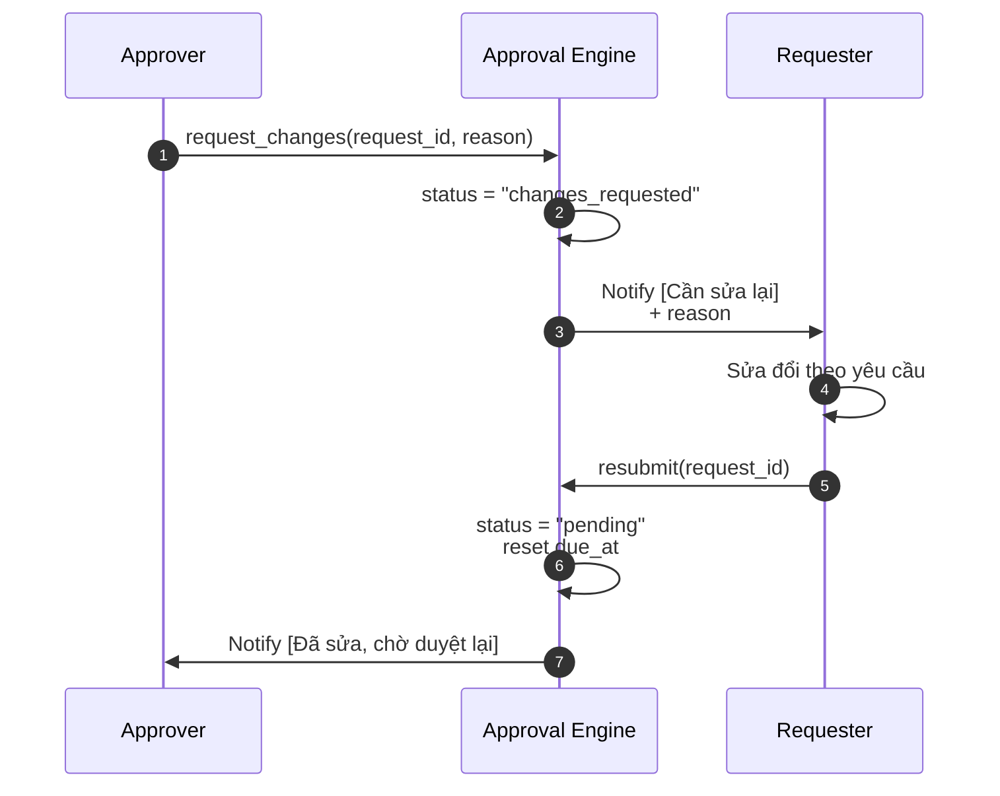
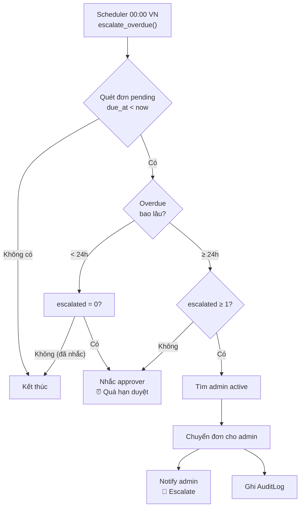
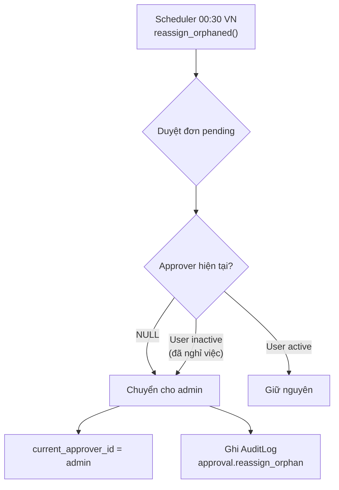
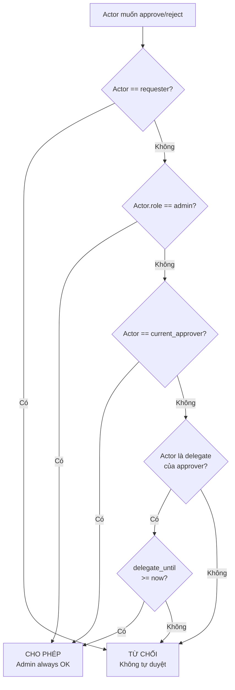
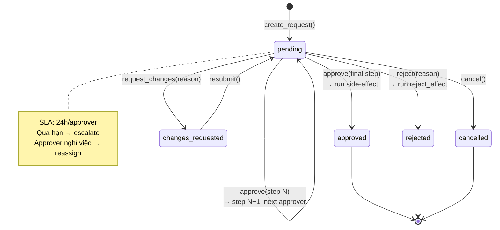

# Flow: Approval Process (Quy trình Phê duyệt)

## Universal Approval Flow

The approval engine is shared across all approval types. This diagram shows the complete lifecycle including delegation, escalation, and side-effects.

```mermaid
sequenceDiagram
    autonumber
    participant Req as Requester<br/>(Nhân viên)
    participant S as System
    participant AE as Approval Engine
    participant A1 as Approver Cấp 1<br/>(Leader)
    participant Del as Delegate<br/>(nếu Leader vắng)
    participant A2 as Approver Cấp 2<br/>(Accountant/Admin)
    participant Sys as Automation
    participant Admin as Admin

    Note over Req,S === TẠO ĐƠN ===
    Req->>S: Tạo đơn (leave/advance/expense/OT)
    S->>AE: create_request(type, ref_id, approver_ids)
    AE->>AE: Loại requester khỏi chuỗi duyệt
    AE->>AE: Tạo ApprovalRequest<br/>step=1, total_steps=len(chain)
    AE->>A1: Notify [Chờ duyệt]<br/>(in-app + Telegram)
    AE->>S: Ghi AuditLog

    Note over A1,S === DUYỆT CẤP 1 ===
    alt A1 có mặt
        A1->>AE: approve(request_id)
    else A1 ủy quyền cho Del
        A1->>S: delegate_to = Del (trước đó)
        Del->>AE: approve(request_id)
        AE->>AE: Kiểm tra ủy quyền hợp lệ
    end

    AE->>AE: step < total_steps?
    AE->>AE: step++ → 2
    AE->>AE: current_approver = A2
    AE->>A2: Notify [Chờ duyệt]
    AE->>S: Ghi AuditLog (approval.approve_step)

    Note over A2,S === DUYỆT CẤP CUỐI ===
    A2->>AE: approve(request_id)
    AE->>AE: step == total_steps → FINAL
    AE->>AE: status = "approved"
    AE->>AE: Run side-effect(type)
    AE->>Req: Notify [Đã duyệt]
    AE->>S: Ghi AuditLog (approval.approve)
```

## Side-Effects by Type



## Rejection Flow



## Request Changes Flow



## Escalation Flow (Overdue Approvals)



## Orphaned Approval Reassignment



## Authorization Rules



## State Machine (Complete)



## Cross-Module Integration Points

| Module | Creates Approval | Side-Effect on Approve |
|--------|-----------------|----------------------|
| Attendance & Leave | `type="leave"` | Update leave request + balance |
| Payroll | `type="advance"` | Update salary advance status |
| Payroll | `type="payroll_period"` | Lock payroll period |
| Finance | `type="expense"` | Record transaction |
| Attendance | `type="overtime"` | Approve OT hours |

## Tags

#flow #approval #workflow #delegation #escalation #cross-module #jama-home
