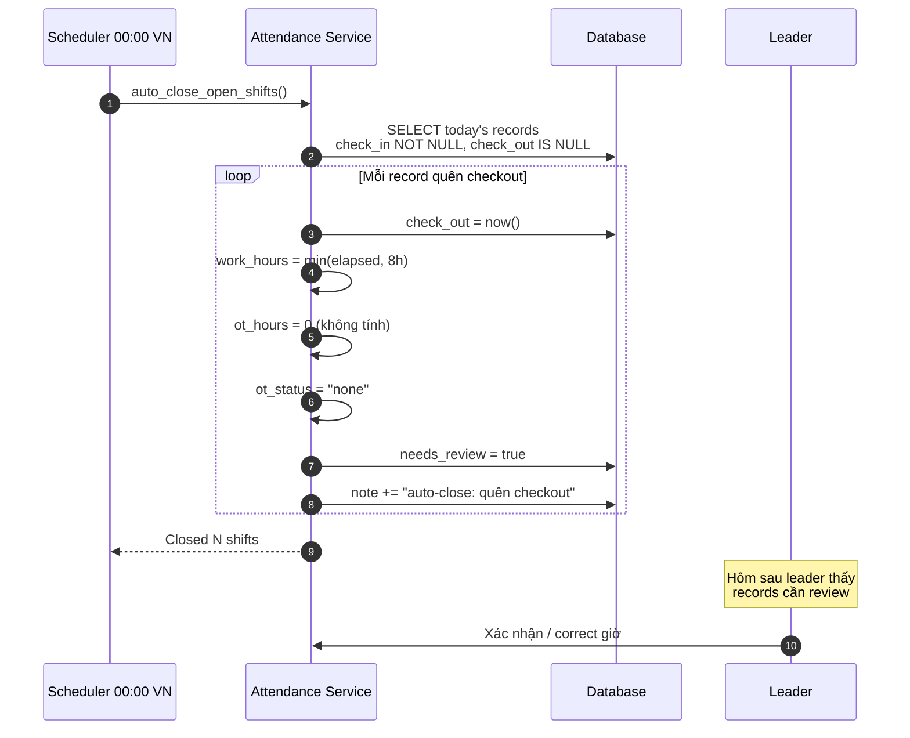
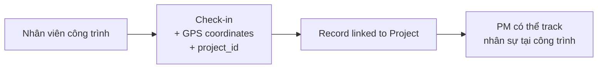
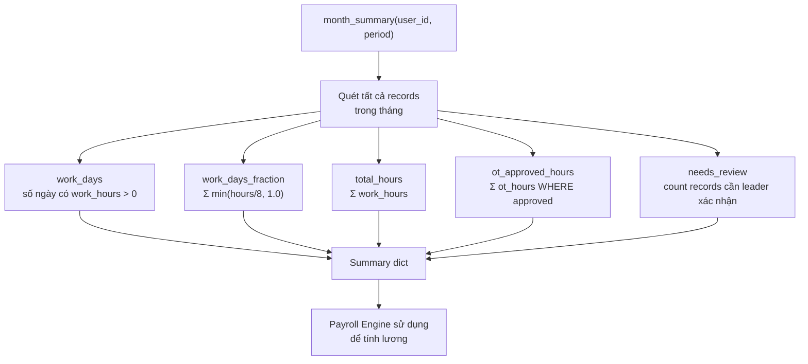
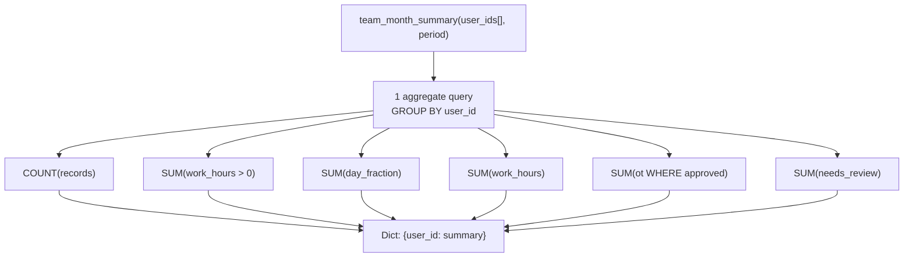

# Flow: Attendance (Quy trình Chấm công)

## Daily Attendance Lifecycle

```mermaid
sequenceDiagram
    autonumber
    participant E as Nhân viên
    participant W as Web / Telegram
    participant AS as Attendance Service
    participant DB as Database
    participant L as Leader
    participant PE as Payroll Engine
    participant Auto as Automation (00:00)

    Note over E,DB === BUỔI SÁNG: CHECK-IN ===
    E->>W: Check-in (web button / Telegram command)
    W->>AS: record_checkin(user, source, project_id?, lat?, lng?)
    AS->>DB: SELECT where user_id + work_date = today

    alt Chưa có record hôm nay
        AS->>DB: INSERT AttendanceRecord
        AS->>DB: check_in = now(), source = web/telegram
        AS-->>W: (record, created=true)
        W-->>E: "Đã check-in 08:15 ✅"
    else Đã check-in rồi
        AS-->>W: (existing_record, created=false)
        W-->>E: "Bạn đã check-in lúc 08:15"
    end

    Note over E: ... Làm việc 8 tiếng ...

    Note over E,DB === BUỔI CHIỀU: CHECK-OUT ===
    E->>W: Check-out
    W->>AS: record_checkout(user)
    AS->>DB: SELECT today's record

    alt Chưa check-in
        AS-->>W: None
        W-->>E: "Chưa check-in hôm nay"
    else Có record
        AS->>AS: elapsed = now - check_in
        AS->>AS: work_hours = min(elapsed, 8h)
        AS->>AS: ot = elapsed - 8h

        alt ot >= 0.5h
            AS->>AS: ot_hours = ot, ot_status = "pending"
        else ot < 0.5h
            AS->>AS: ot_hours = 0, ot_status = "none"
        end

        AS->>DB: UPDATE record
        AS-->>W: record (work_hours, ot_hours, ot_status)
        W-->>E: "Check-out 17:30 | Công: 8h | OT: 1h (chờ duyệt)"
    end

    Note over L,AS === LEADER DUYỆT OT ===
    L->>AS: View attendance with pending OT
    L->>AS: Approve/reject OT
    AS->>DB: ot_status → approved/rejected
```

## Auto-Close Forgotten Checkout



## On-Site Attendance (Construction)



## Attendance Sources

| Source | Vietnamese | Description |
|--------|-----------|-------------|
| `web` | Web | Check-in/out via web browser |
| `telegram` | Telegram | Check-in/out via Telegram bot |
| `leave` | Nghỉ phép | Auto-created when leave approved |
| `auto` | Tự động | Auto-close by scheduler |

## Month Summary (for Payroll)



## Team Month Summary (Batch Query)

For 200 employees, individual queries would be expensive. The system uses a single aggregate query:



## Attendance Rules Summary

| Rule | Implementation |
|------|---------------|
| 1 record per user per day | DB unique index (user_id, work_date) |
| Max 8h work_hours | `min(elapsed, 8.0)` |
| OT threshold | >= 0.5h (below noise) |
| OT needs approval | `ot_status = "pending"` until leader action |
| Period lock | `is_period_locked()` blocks edits if payroll approved/paid |
| Forgotten checkout | Auto-close at midnight, `needs_review = true` |
| Leave day | Auto-created AttendanceRecord with `source = "leave"` |

## Integration Points

```mermaid
graph TB
    Attendance["Attendance Module"] --> Payroll["Payroll Engine<br/>(work_days, OT)"]
    Attendance --> KPI["KPI Engine<br/>(activity_rate)"]
    Attendance --> Burnout["Burnout Detection<br/>(OT, Sunday work)"]
    Leave["Leave Module"] --> Attendance<br/>source="leave"
    Approval["Approval Engine"] --> Attendance<br/>OT approval
```

## Tags

#flow #attendance #check-in #overtime #cross-module #jama-home
