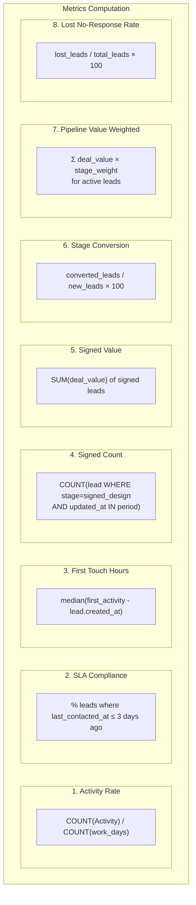
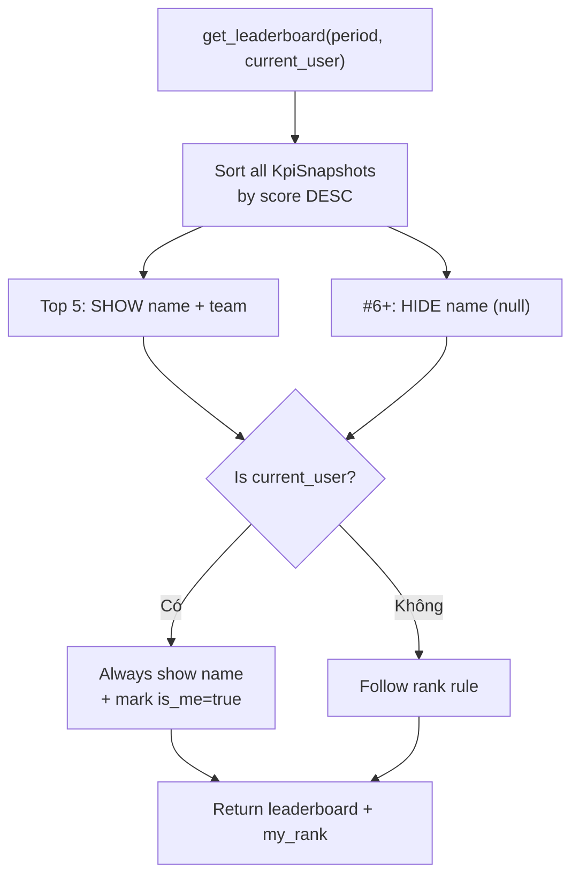
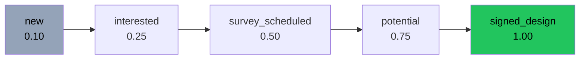

# Flow: KPI Computation (Quy trình Tính KPI)

## Monthly KPI Snapshot Flow

```mermaid
sequenceDiagram
    autonumber
    participant S as Scheduler<br/>00:10 VN ngày 1
    participant KE as KPI Engine
    participant DB as Database

    S->>KE: snapshot_all(period="2026-07")
    KE->>DB: SELECT active users (role IN sales_roles)

    loop Mỗi user (batch, không N+1)
        KE->>DB: 1. COUNT AttendanceRecord → work_days
        KE->>DB: 2. COUNT Activity (via leads) → activity_count
        KE->>DB: 3. SELECT active leads → SLA compliance
        KE->>DB: 4. SELECT signed leads → signed_count, signed_value
        KE->>DB: 5. COUNT new + converted → stage_conversion
        KE->>DB: 6. SELECT active leads w/ deal_value → pipeline_weighted
        KE->>DB: 7. COUNT lost leads → lost_no_response_rate

        KE->>KE: Compute composite score
        Note over KE
            effort = act_rate×5 + sla×0.5 + (48-first_touch)×2
            outcome = signed×20 + conv×0.5 + pipeline/100M
            quality = 100 - recall×10 - lost_rate
            score = effort×0.3 + outcome×0.5 + quality×0.2
        end note

        KE->>DB: UPSERT KpiSnapshot (metrics + score)
    end

    KE->>KE: _compute_ranks()
    KE->>DB: Set rank_in_team per team
    KE->>DB: Set rank_overall
```

## Burnout Detection Flow

```mermaid
flowchart TD
    A["detect_burnout(user_id)"] --> B["Parallel checks"]

    B --> C["Check 1: OT Extended"]
    B --> D["Check 2: Sunday Work"]
    B --> E["Check 3: No Leave"]
    B --> F["Check 4: Lead Overload"]

    C --> C1{"OT > 10h/tuần<br/>× 3 tuần liên tiếp?"}
    C1 -->|"Có"| C2["+1 signal: ot_extended"]

    D --> D1{"Làm CN ≥ 3 ngày<br/>trong 30 ngày?"}
    D1 -->|"Có"| D2["+1 signal: sunday_work"]

    E --> E1{"Nghỉ phép trong<br/>90 ngày = 0?"}
    E1 -->|"Có"| E2["+1 signal: no_leave"]

    F --> F1{"Active leads > 25?"}
    F1 -->|"Có"| F2["+1 signal: lead_overload"]

    C2 --> G["Count total signals"]
    D2 --> G
    E2 --> G
    F2 --> G

    G --> H{"0-1 signals"| GREEN}
    G --> I{"2 signals"| YELLOW}
    G --> J{"≥ 3 signals"| RED}
```

## 8 Metrics Detail



## Leaderboard Anonymization



## Stage Weights



## Tags

#flow #kpi #performance #burnout #leaderboard #jama-home
