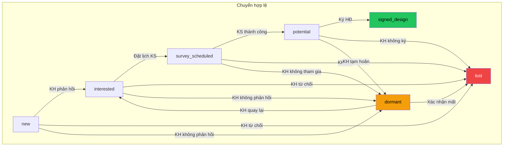
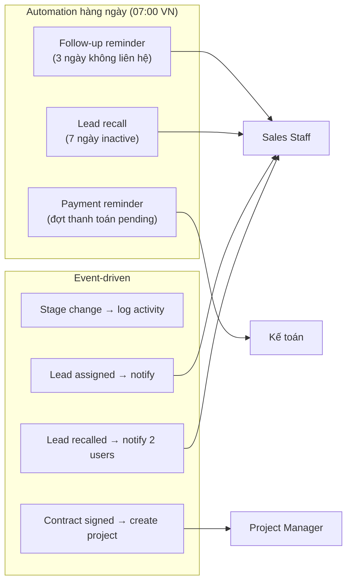
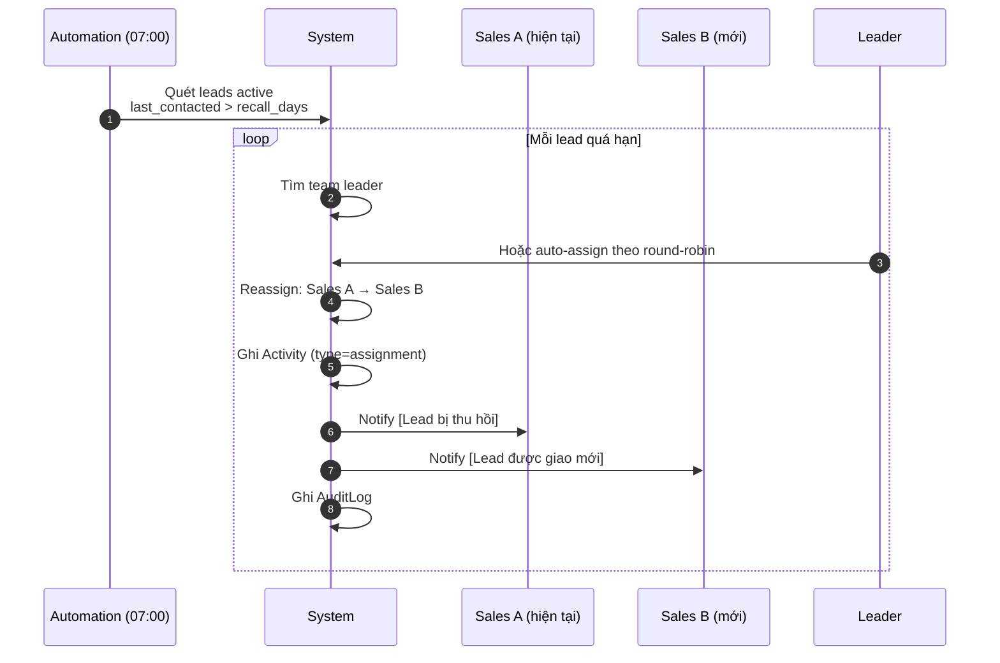

# Flow: Lead Pipeline (Quy trình Pipeline Lead)

## End-to-End Lead Lifecycle

This flow traces a lead from initial capture through all pipeline stages to either conversion or loss, showing cross-module interactions.

```mermaid
sequenceDiagram
    autonumber
    participant FB as Facebook/Zalo/Website
    participant DE as Data Entry
    participant S as CRM System
    participant AI as AI Service
    participant L as Leader
    participant Sales as Sales Staff
    participant C as Customer
    participant AE as Approval Engine
    participant P as Project Module
    participant Auto as Automation

    Note over FB,S === GIAI ĐOẠN 1: TIẾP NHẬN LEAD ===
    FB->>S: Lead từ nguồn (FB/Zalo/Web/Ref)
    S->>S: Tạo Lead (stage=new)
    S->>AI: Request AI scoring
    AI-->>S: ai_score + ai_notes
    L->>S: Giao lead cho nhân viên
    S->>S: assigned_to = sales_user
    S->>Sales: Notify [Lead được giao]

    Note over Sales,C === GIAI ĐOẠN 2: LIÊN HỆ & TƯ VẤN ===
    Sales->>C: Gọi điện / Nhắn tin
    Sales->>S: Ghi Activity (type=call)
    C-->>Sales: Phản hồi quan tâm
    Sales->>S: Chuyển stage: new → interested
    S->>S: Log stage_change activity
    S->>S: Update last_contacted_at

    Note over Auto,S --- Automation ---
    Auto->>S: Check: lead không liên hệ > 3 ngày?
    S->>Sales: Notify [Nhắc CSKH]

    Note over Sales,C === GIAI ĐOẠN 3: ĐẶT LỊCH KHẢO SÁT ===
    Sales->>C: Hẹn lịch khảo sát
    C-->>Sales: Đồng ý ngày khảo sát
    Sales->>S: Chuyển stage: interested → survey_scheduled
    Sales->>S: Set survey_date

    Note over Sales,C === GIAI ĐOẠN 4: KHẢO SÁT THỰC ĐỊA ===
    Sales->>C: Khảo sát thực địa
    Sales->>S: Ghi Activity (type=survey)
    Sales->>S: Upload survey_photos
    Sales->>S: Cập nhật area_sqm, property_type
    C-->>Sales: Xác nhận muốn ký HĐ
    Sales->>S: Chuyển stage: survey_scheduled → potential

    Note over Sales,C === GIAI ĐOẠN 5: CHỐT DEAL ===
    Sales->>S: Tạo Quotation (design)
    Sales->>C: Gửi báo giá
    C-->>Sales: Đồng ý ký HĐ
    Sales->>S: Chuyển stage: potential → signed_design
    S->>S: Set design_contract_value

    Note over S,P === GIAI ĐOẠN 6: CHUYỂN ĐỔI ===
    S->>S: Tạo Customer từ Lead
    S->>S: Tạo Contract từ Quotation
    S->>P: Tạo Project mới
    S->>P: Assign PM + Designer
    P->>Sales: Notify [Dự án đã tạo]

    Note over Auto,S --- Nếu KH từ chối ---
    Note over Sales: KH không phản hồi / từ chối
    Sales->>S: Chuyển stage → lost hoặc dormant
    S->>S: Ghi lý do lost
```

## Stage Transition Rules



## Automation Touchpoints



## Lead Recall Process



## KPI Impact

Each stage action affects the performer's KPI metrics:

| Action | KPI Metric Affected |
|--------|-------------------|
| Ghi Activity | Activity Rate (+) |
| Liên hệ trong 3 ngày | SLA Compliance (+) |
| Liên hệ đầu tiên | First Touch Hours (measured) |
| Chuyển stage → signed | Signed Count (+), Signed Value (+) |
| Chuyển stage (any) | Stage Conversion (measured) |
| Lead bị lost | Lost No-Response Rate (-) |
| Lead active | Pipeline Value Weighted (measured) |

## Tags

#flow #lead-pipeline #crm #cross-module #jama-home
