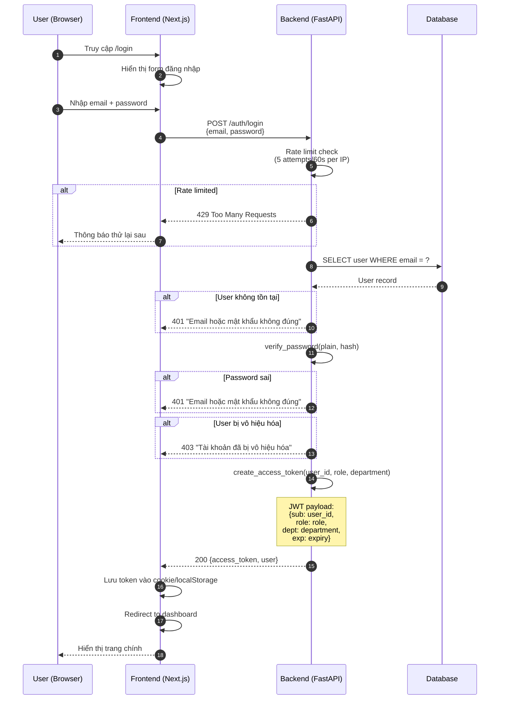
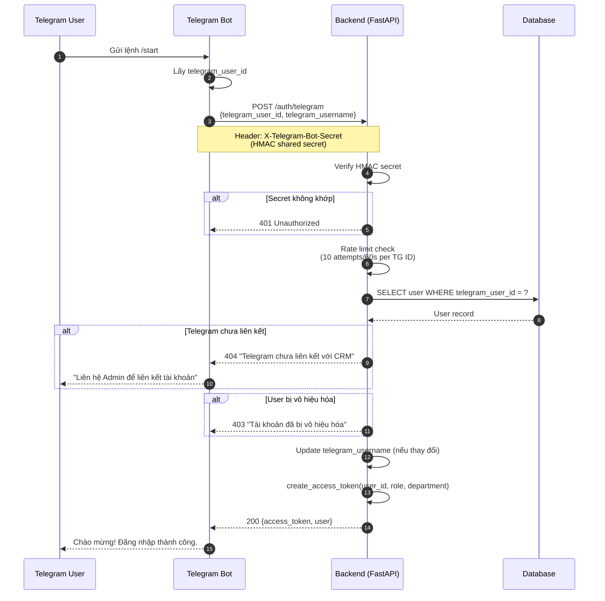
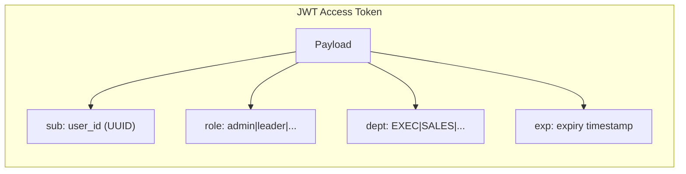
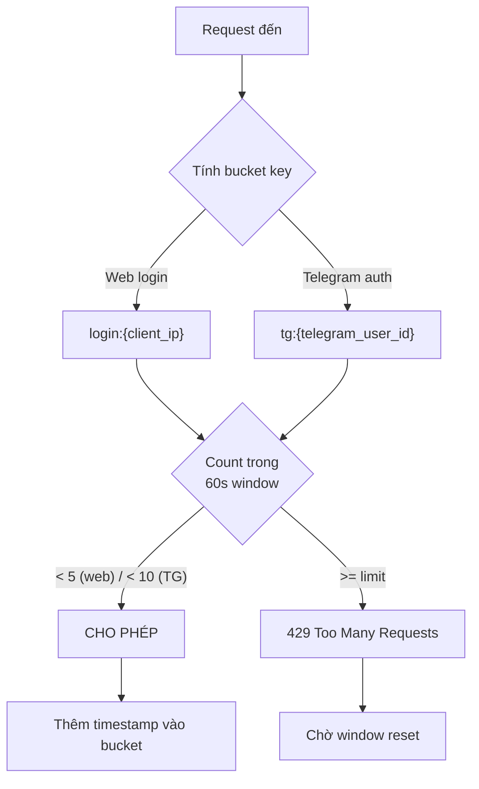
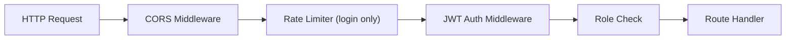
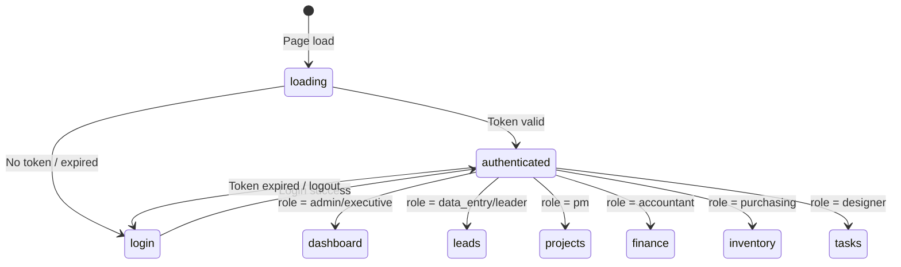

# Flow: Authentication (Quy trình Đăng nhập)

## Web Login Flow

## Telegram Bot Auth Flow

## JWT Token Structure

## Rate Limiting

## Middleware Chain

## Security Features

| Feature | Implementation |
|---------|---------------|
| Password hashing | bcrypt |
| Token format | JWT with role + department claims |
| Rate limiting | In-memory, per-IP (web), per-TG-ID (bot) |
| Telegram auth | HMAC shared secret verification |
| Timing attack prevention | `hmac.compare_digest()` for secret comparison |
| Account deactivation | `is_active` check before token issuance |
| Error messages | Generic "email hoặc mật khẩu không đúng" (no enumeration) |

## Frontend Auth State

## Tags

#flow #auth #login #security #jwt #telegram #jama-home
