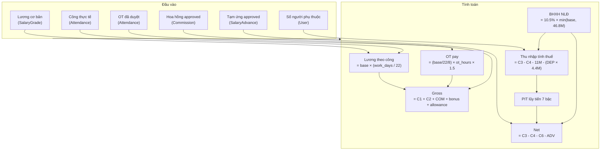
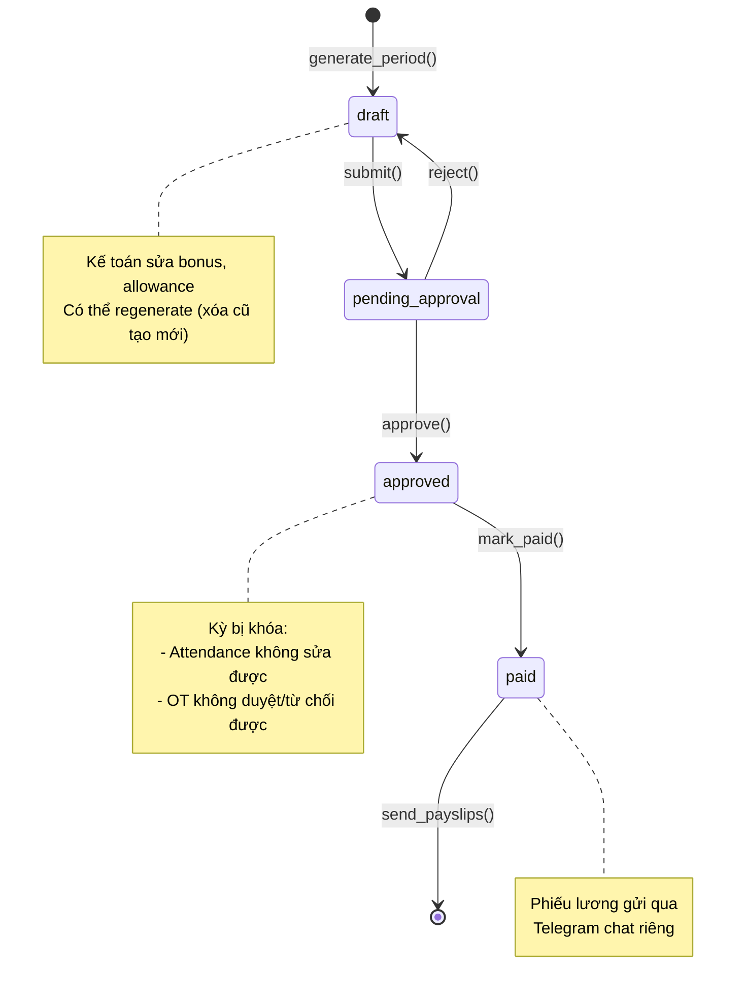
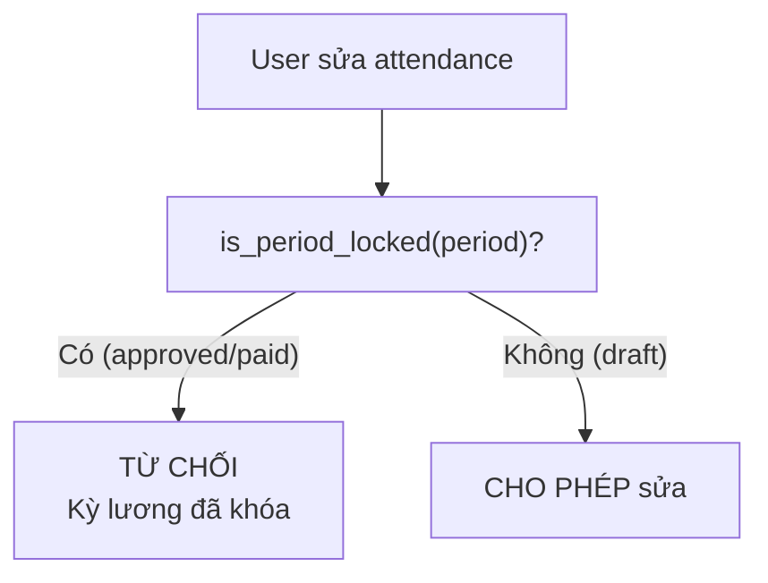
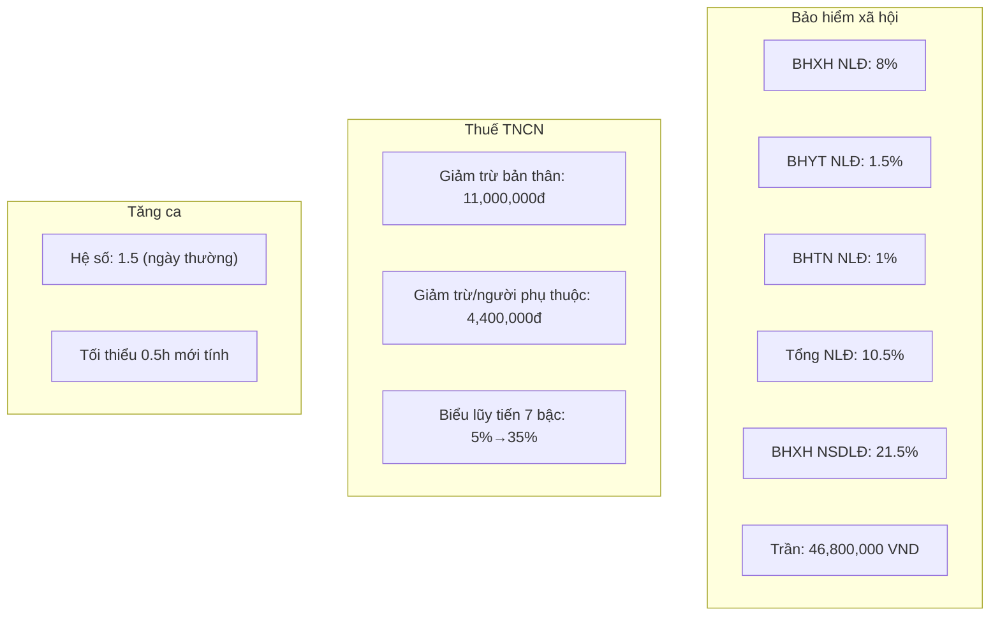

# Flow: Payroll Generation (Quy trình Tính lương)

## End-to-End Payroll Flow

```mermaid
sequenceDiagram
    autonumber
    participant A as Kế toán
    participant PE as Payroll Engine
    participant AS as Attendance Service
    participant AE as Approval Engine
    participant DB as Database
    participant L as Leader / Admin
    participant E as Nhân viên
    participant TG as Telegram Bot

    Note over A,DB === BƯỚC 1: GENERATE BẢNG LƯƠNG ===
    A->>PE: generate_period(period="2026-07")
    PE->>DB: Check: kỳ đã khóa chưa?
    alt Kỳ đã approved/paid
        PE-->>A: Error: "Kỳ đã khóa"
    end
    PE->>DB: DELETE old drafts of period

    loop Mỗi nhân viên active
        PE->>DB: GET User + SalaryGrade
        PE->>AS: month_summary(user_id, period)
        AS->>DB: Aggregate attendance records
        AS-->>PE: {work_days, ot_approved_hours}

        PE->>DB: SUM(commission WHERE approved)
        PE->>DB: SUM(salary_advance WHERE approved)
        PE->>PE: build_payroll_row()

        Note over PE
            gross = base × (work_days/22) + ot_pay + commission
            BHXH = 10.5% × min(base, cap)
            taxable = gross - BHXH - 11M - (deps × 4.4M)
            PIT = lũy tiến 7 bậc
            net = gross - BHXH - PIT - advances
        end note

        PE->>DB: INSERT Payroll (status=draft)
    end

    PE-->>A: {created: 200, total_net: X, missing_grade: N}

    Note over A,PE === BƯỚC 2: REVIEW & CHỈNH SỬA ===
    A->>DB: Xem bảng lương draft
    A->>DB: Chỉnh sửa bonus/allowance (nếu cần)

    Note over A,AE === BƯỚC 3: SUBMIT DUYỆT ===
    A->>AE: Submit payroll_period cho duyệt
    AE->>AE: Tạo ApprovalRequest
    AE->>L: Notify [Chờ duyệt bảng lương]

    Note over L,AE === BƯỚC 4: DUYỆT ===
    L->>AE: approve()
    AE->>AE: status = approved
    AE->>PE: Side-effect: Payroll.status → approved
    PE->>DB: Lock period (khóa mọi sửa attendance/OT)
    AE->>A: Notify [Bảng lương đã duyệt]

    Note over A,DB === BƯỚC 5: ĐÁNH DẤU ĐÃ TRẢ ===
    A->>PE: Mark payroll period as paid
    PE->>DB: Payroll.status → paid, paid_at = now

    Note over PE,TG === BƯỚC 6: GỬI PHIẾU LƯƠNG ===
    A->>PE: send_payslips(period)
    loop Mỗi payslip (status=paid)
        PE->>DB: GET Payroll + User
        alt User có telegram_user_id
            PE->>PE: format_payslip()
            PE->>TG: Send DM (chat riêng)
            PE->>DB: payslip_sent_at = now
        else User chưa liên kết Telegram
            PE->>PE: Thêm vào no_telegram list
        end
    end
    PE-->>A: {sent: 195, manual_delivery: ["Nguyễn X", "Trần Y"]}
```

## Salary Calculation Breakdown



## Payroll Status Lifecycle



## Period Locking

When payroll is approved or paid, the attendance service refuses modifications:



## Insurance & Tax Reference



## Tags

#flow #payroll #salary #tax #bhxh #cross-module #jama-home
