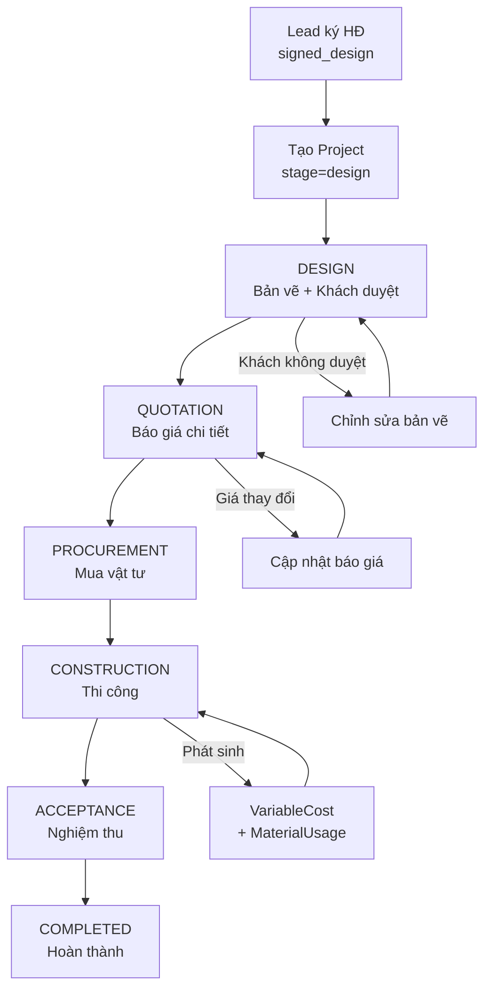
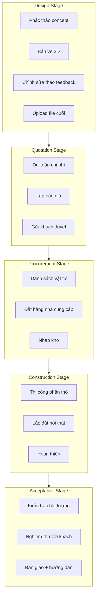
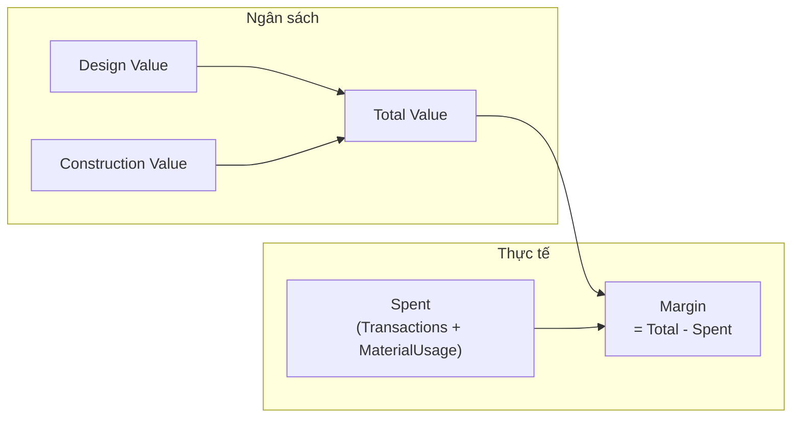
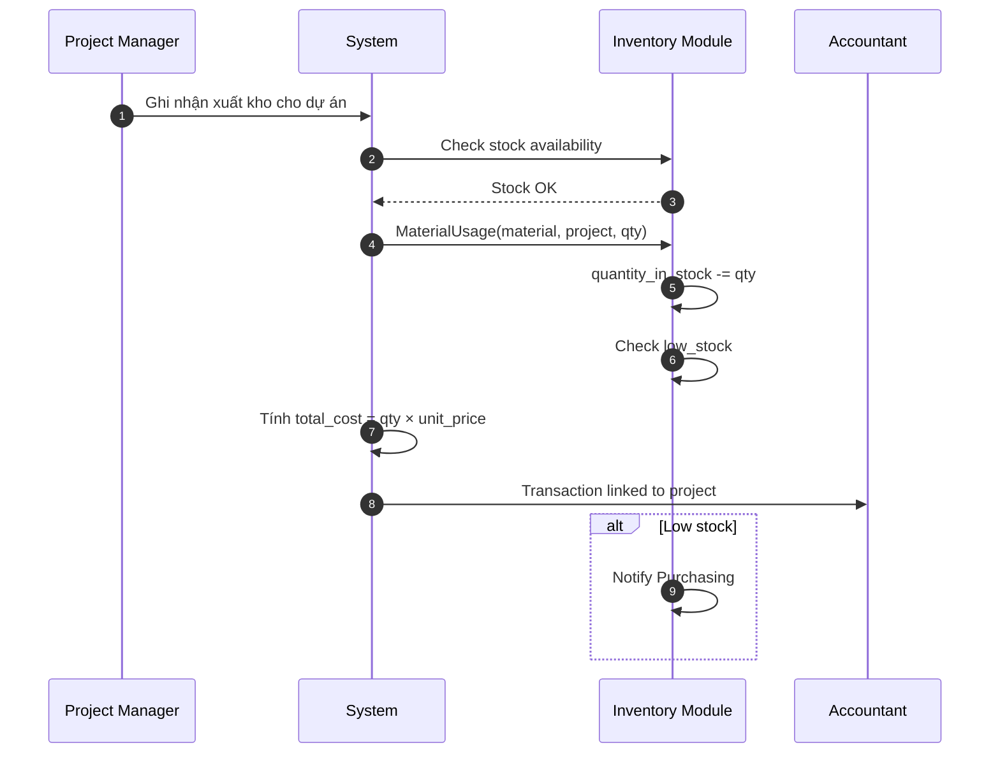
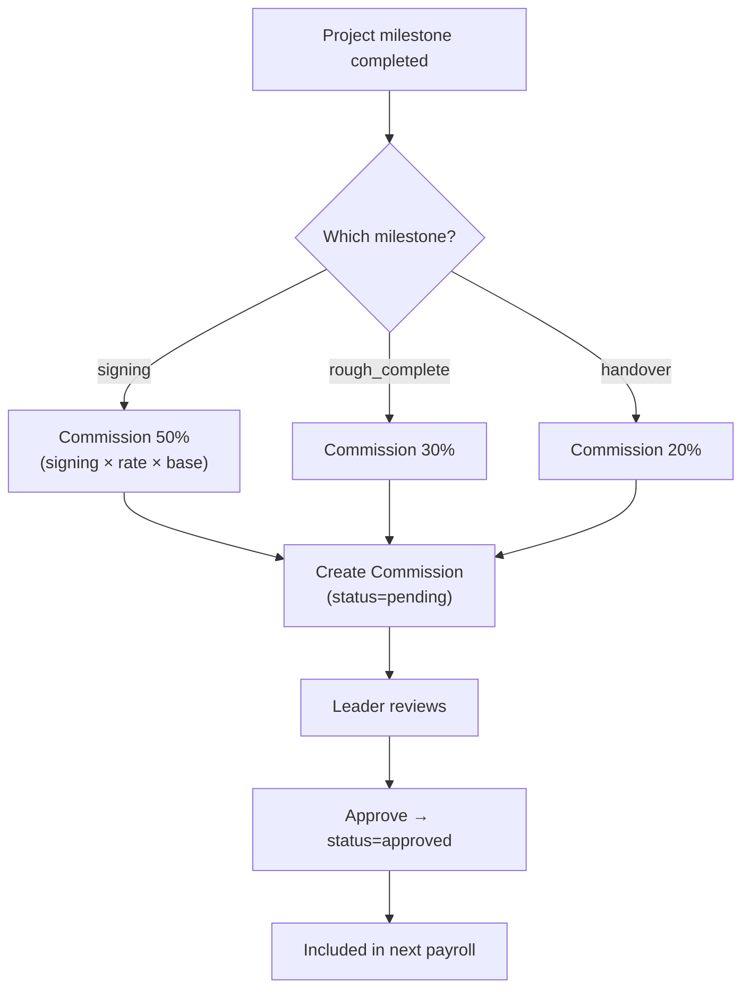

# Flow: Project Lifecycle (Quy trình Vòng đời Dự án)

## End-to-End Project Lifecycle

```mermaid
sequenceDiagram
    autonumber
    participant Sales as Sales
    participant S as CRM System
    participant PM as Project Manager
    participant Designer as Designer
    participant Purchasing as Thu mua
    participant ACCT as Kế toán
    participant Customer as Khách hàng
    participant Inventory as Inventory Module

    Note over Sales,S === KHỞI TẠO DỰ ÁN ===
    Sales->>S: Lead stage = signed_design
    S->>S: Tạo Customer từ Lead
    S->>S: Tạo Contract từ Quotation
    S->>S: Tạo Project (stage=design)
    S->>PM: Giao dự án cho PM
    S->>Designer: Giao task thiết kế

    Note over Designer,Customer === GIAI ĐOẠN 1: THIẾT KẾ (design) ===
    Designer->>S: Tạo tasks (phác thảo, 3D, chỉnh sửa)
    Designer->>S: Upload bản vẽ
    Designer->>S: Ghi TaskActivity (comment, file)
    Designer->>Customer: Trình bày bản vẽ
    Customer-->>Designer: Phản hồi, yêu cầu sửa
    Designer->>S: Cập nhật task status → done
    S->>S: Project.stage = quotation

    Note over ACCT,Customer === GIAI ĐOẠN 2: BÁO GIÁ (quotation) ===
    Sales->>S: Tạo báo giá chi tiết
    ACCT->>S: Review pricing
    S->>Customer: Gửi báo giá
    Customer-->>S: Duyệt báo giá
    S->>S: Tạo/generate Contract
    S->>S: Project.stage = procurement

    Note over Purchasing,Inventory === GIAI ĐOẠN 3: MUA SẮM (procurement) ===
    PM->>S: Tạo danh sách vật tư cần mua
    Purchasing->>S: Cập nhật Material tồn kho
    Purchasing->>Inventory: Mua vật tư thiếu
    Inventory->>S: Cập nhật quantity_in_stock
    S->>S: Project.stage = construction

    Note over PM,Customer === GIAI ĐOẠN 4: THI CÔNG (construction) ===
    PM->>S: Quản lý tasks thi công
    PM->>S: Ghi nhận xuất kho (MaterialUsage)
    Inventory->>Inventory: Trừ tồn kho
    PM->>S: Cập nhật progress (%)
    PM->>ACCT: Báo cáo chi phí thực tế
    ACCT->>S: Ghi Transaction (expense)

    Note over PM,Customer === GIAI ĐOẠN 5: NGHIỆM THU (acceptance) ===
    PM->>Customer: Mời nghiệm thu
    Customer-->>PM: Nghiệm thu + yêu cầu chỉnh sửa
    PM->>S: Hoàn thiện task cuối
    S->>S: Project.stage = completed
    ACCT->>S: Ghi nhận thanh toán cuối

    Note over S === HOÀN THÀNH ===
    S->>S: Project.status = completed
    S->>S: Tính toán final financials
```

## Project Stage Flowchart



## Task Management per Stage



## Financial Tracking per Project



## Payment Milestones

```mermaid
gantt
    title Thanh toán theo tiến độ dự án
    dateFormat X
    axisFormat %s%%

    section Hợp đồng
    Đợt 1: Đặt cọc 25%        :done, m1, 0, 25
    Đợt 2: Phần thô 25%       :active, m2, 25, 50
    Đợt 3: Nội thất 25%       :m3, 50, 75
    Đợt 4: Bàn giao 25%       :m4, 75, 100
```

## Material Usage Integration



## Commission Trigger



## Tags

#flow #project #lifecycle #cross-module #construction #jama-home
