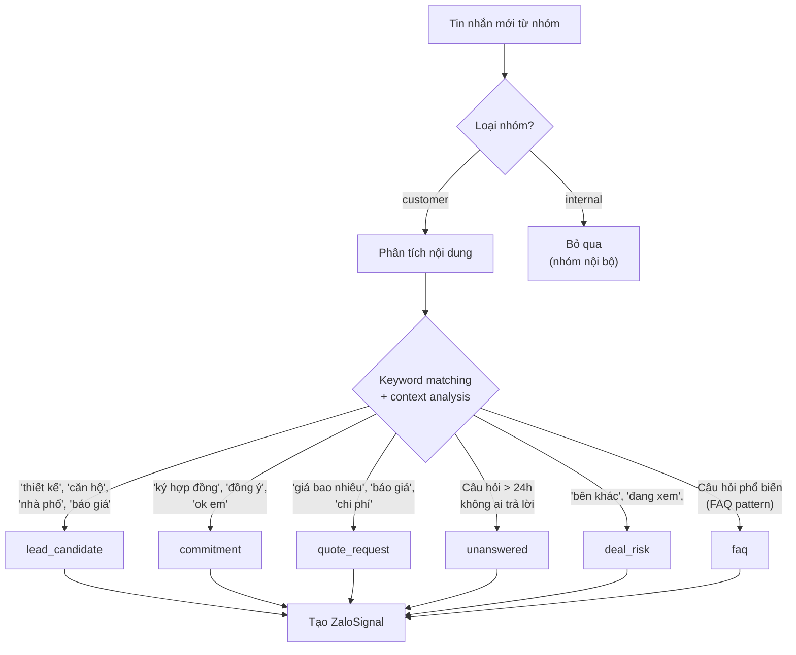
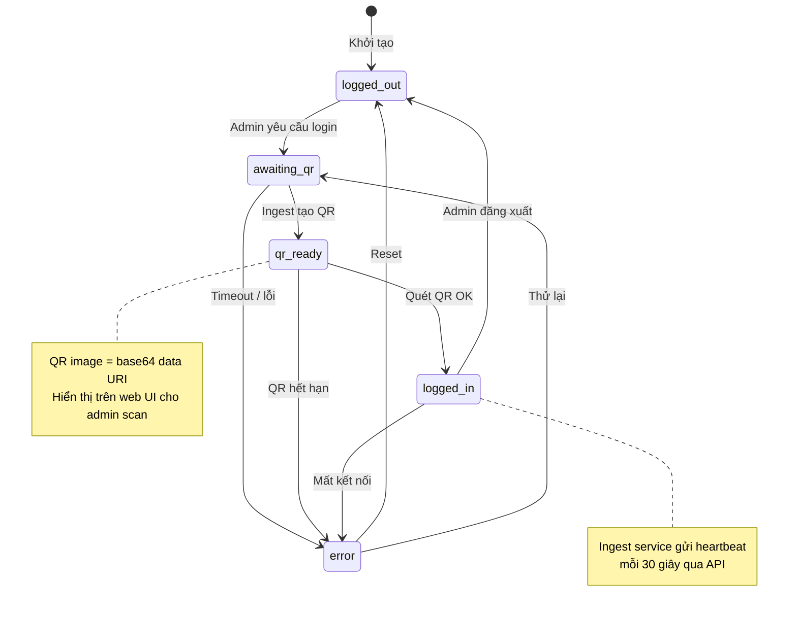
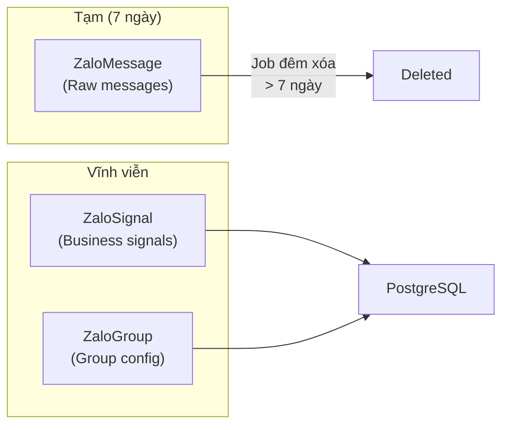

# Flow: Zalo Listener (Quy trình Nghe nhóm Zalo)

## End-to-End Zalo Listener Flow

```mermaid
sequenceDiagram
    autonumber
    participant Admin as Admin
    participant Web as Web UI
    participant BE as FastAPI Backend
    participant DB as Database
    participant Ingest as Node.js Ingest<br/>(zca-js)
    participant Zalo as Zalo App
    participant TG as Telegram Bot
    participant Sales as Sales Staff

    Note over Admin,Zalo === ĐĂNG NHẬP ZALO ===
    Admin->>Web: Nhấn "Đăng nhập Zalo"
    Web->>BE: POST /zalo/session/login
    BE->>DB: ZaloSession.login_requested = true

    Ingest->>BE: Poll session (heartbeat)
    BE-->>Ingest: login_requested = true
    Ingest->>Ingest: Generate QR code
    Ingest->>BE: PUT /zalo/session/qr (base64 image)
    BE->>DB: ZaloSession.status = qr_ready

    Web->>Web: Hiển thị QR code
    Admin->>Zalo: Quét QR bằng Zalo mobile
    Zalo-->>Ingest: Login success
    Ingest->>BE: Heartbeat (status=logged_in)
    BE->>DB: ZaloSession.status = logged_in

    Note over Zalo,Sales === NHẬN & PHÂN TÍCH TIN NHẮN ===
    loop Mỗi tin nhắn nhóm
        Zalo->>Ingest: Group message received
        Ingest->>BE: POST /zalo/messages
        BE->>DB: INSERT ZaloMessage

        BE->>BE: Analyze message content
        alt Lead candidate detected
            BE->>DB: INSERT ZaloSignal (type=lead_candidate)
            BE->>TG: Notify assigned_user
            BE->>Sales: Signal dashboard update
        else Commitment detected
            BE->>DB: INSERT ZaloSignal (type=commitment)
            BE->>TG: Notify assigned_user
        else Quote request detected
            BE->>DB: INSERT ZaloSignal (type=quote_request)
            BE->>TG: Notify assigned_user
        else Customer question unanswered > 24h
            BE->>DB: INSERT ZaloSignal (type=unanswered)
        else Deal risk keyword
            BE->>DB: INSERT ZaloSignal (type=deal_risk)
            BE->>TG: Urgent notification
        end
    end

    Note over Sales === XỬ LÝ SIGNALS ===
    Sales->>Web: Xem signal dashboard
    Sales->>Web: Action signal
    alt Tạo lead từ signal
        Sales->>BE: POST /zalo/signals/{id}/create-lead
        BE->>BE: Tạo Lead mới từ signal
        BE->>DB: Signal.status → actioned
    else Bỏ qua
        Sales->>BE: PUT /zalo/signals/{id} (dismissed)
    end

    Note over Ingest,DB === DỌN DẸP (Job đêm) ===
    BE->>DB: DELETE ZaloMessages WHERE created_at < now - 7 days
    Note over DB: Signals giữ lại (permanent)
```

## Signal Detection Logic



## Session State Machine



## Data Retention



## Tags

#flow #zalo #listener #signals #messaging #cross-module #jama-home
