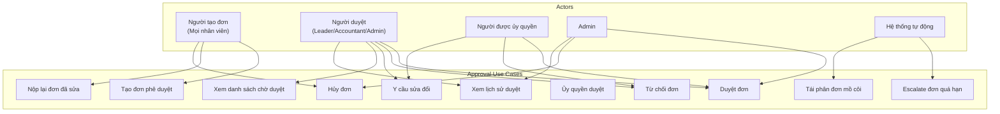
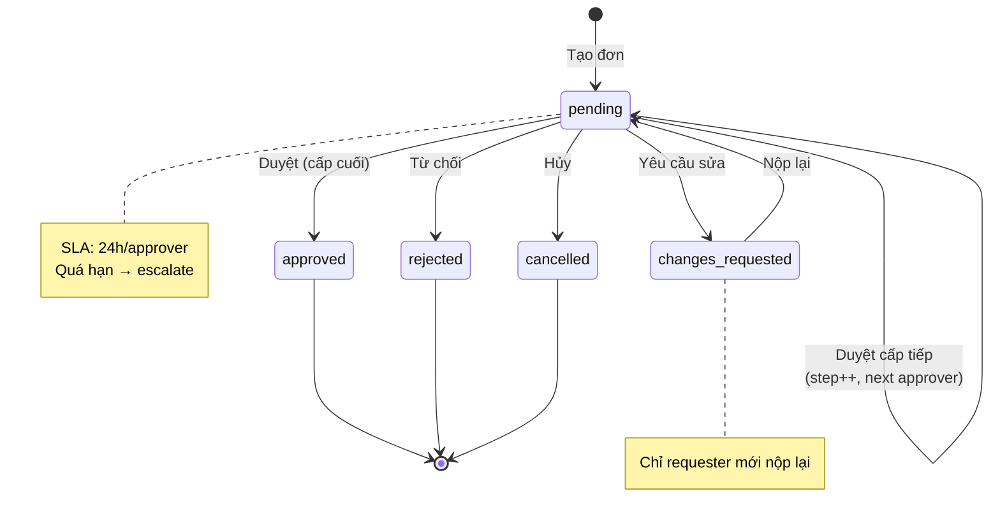
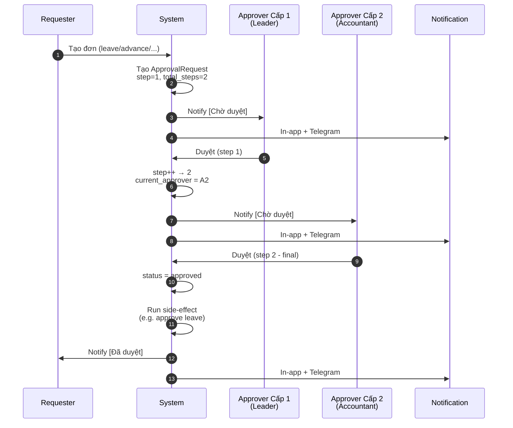
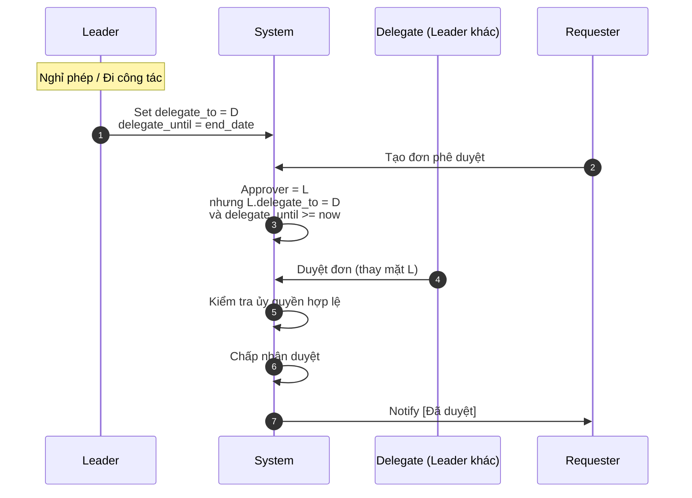
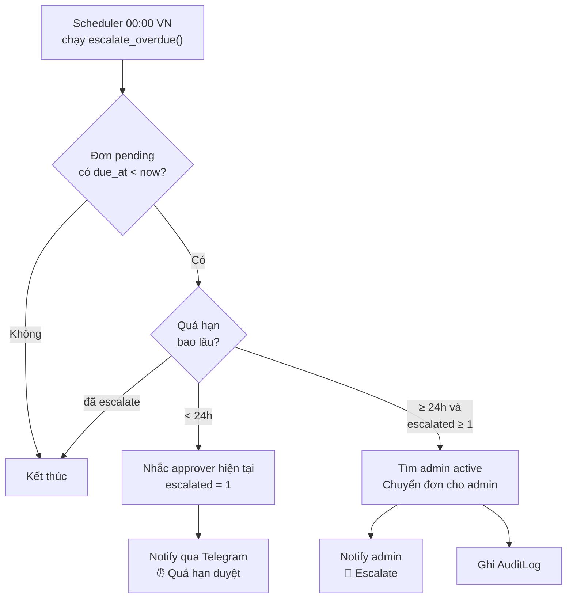
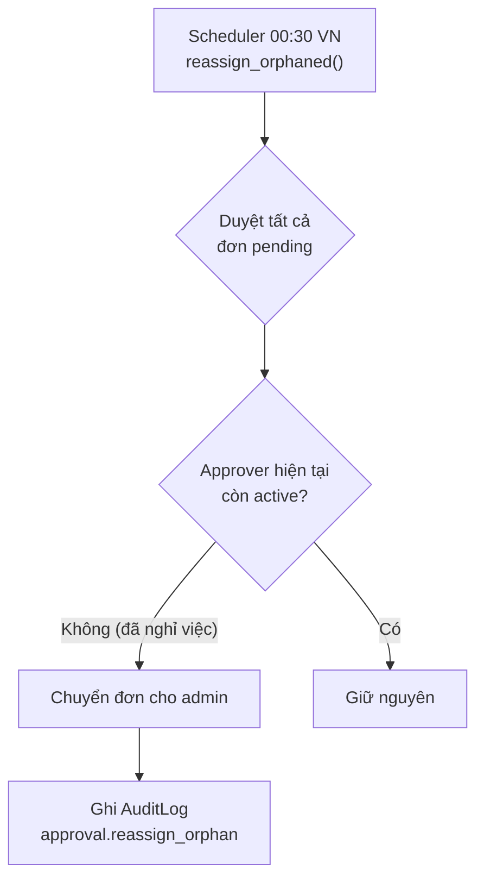
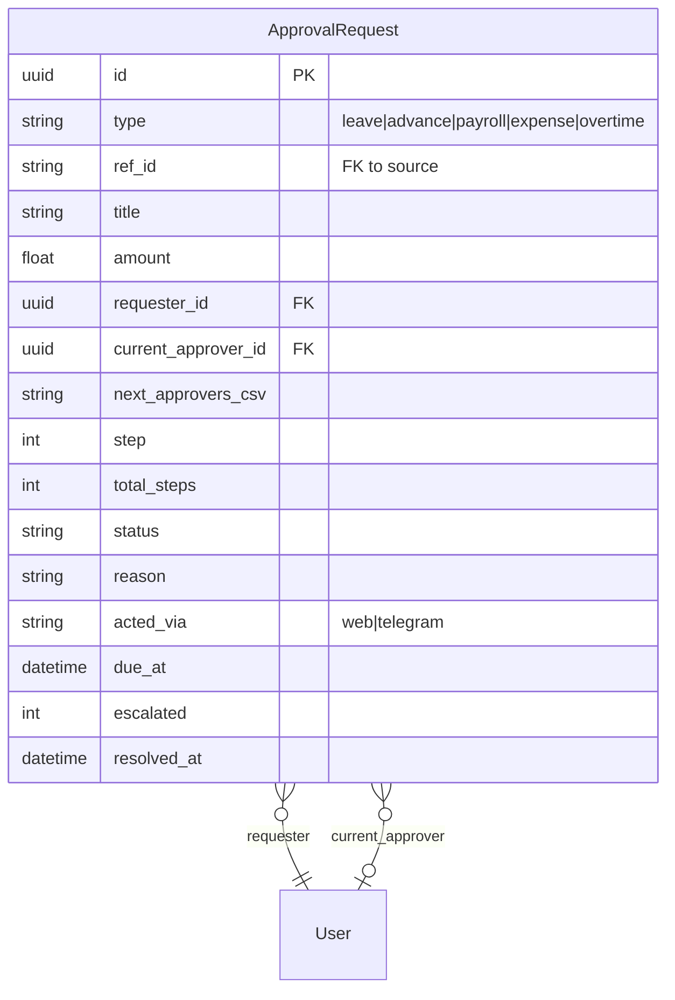

# Module: Approval Engine (Phê duyệt)

## Overview

The Approval Engine is a shared, pluggable approval system used across multiple business domains: leave requests, salary advances, payroll periods, expenses, and overtime. It supports multi-step approval chains (1-3 levels), delegation, escalation, and side-effect execution on approval.

## Use Case Diagram

## Approval Types

| Type | Vietnamese | Source Module | Side Effect on Approve |
|------|-----------|-------------|----------------------|
| `leave` | Nghỉ phép | Attendance & Leave | Update LeaveRequest.status → approved, deduct LeaveBalance |
| `advance` | Tạm ứng | Payroll | Update SalaryAdvance.status → approved |
| `payroll_period` | Bảng lương | Payroll | Lock period, send payslips |
| `expense` | Chi phí | Finance | Record transaction |
| `overtime` | Tăng ca | Attendance | Update AttendanceRecord.ot_status → approved |

## State Machine

## Multi-Step Approval Flow

## Delegation Flow

## Escalation Flow

## Orphaned Approval Reassignment

## Business Rules (Invariants)

| # | Rule | Enforcement |
|---|------|------------|
| 1 | Side-effect chỉ chạy khi đủ `total_steps` approve | `approve()` checks step == total_steps |
| 2 | Đơn đã resolve không thể approve/reject lần nữa | Status check → HTTP 409 |
| 3 | Requester không thể tự duyệt đơn của mình | `_authorize_actor()` checks requester_id |
| 4 | Mọi chuyển trạng thái ghi AuditLog | `log_action()` called in every state transition |
| 5 | Row-level lock prevents concurrent approve/reject | `with_for_update()` on query |
| 6 | Admin always authorized | `_authorize_actor()` role check |
| 7 | Delegation only valid within `delegate_until` | Time comparison in `_authorize_actor()` |

## Data Model

## API Endpoints

| Method | Endpoint | Description | Roles |
|--------|----------|-------------|-------|
| GET | `/approvals` | List approvals (filtered by role) | All |
| GET | `/approvals/{id}` | Get approval detail | requester, approver, admin |
| POST | `/approvals/{id}/approve` | Approve current step | approver, delegate, admin |
| POST | `/approvals/{id}/reject` | Reject with reason | approver, delegate, admin |
| POST | `/approvals/{id}/request-changes` | Request modifications | approver, delegate, admin |
| POST | `/approvals/{id}/resubmit` | Resubmit after changes | requester |
| POST | `/approvals/{id}/cancel` | Cancel request | requester, admin |

## Tags

#module #approval #workflow #delegation #jama-home
