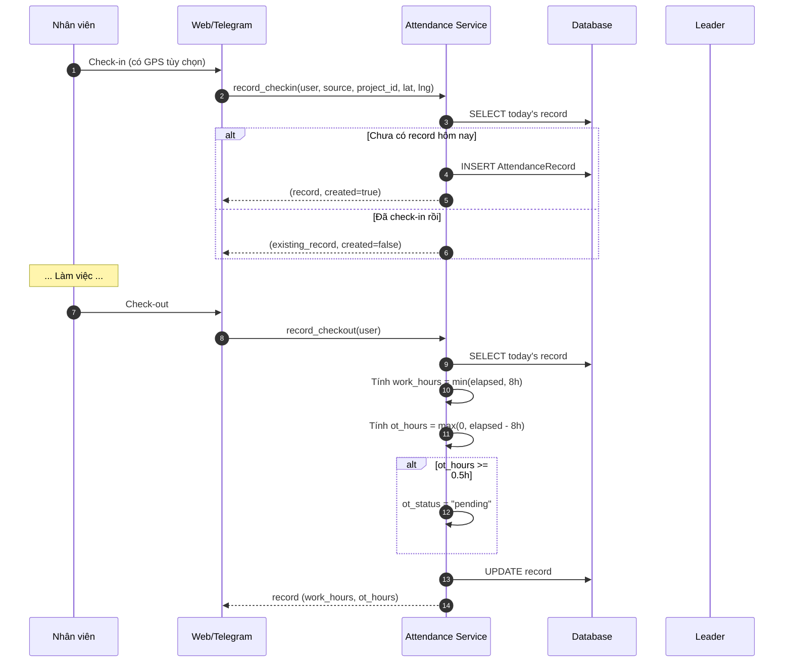
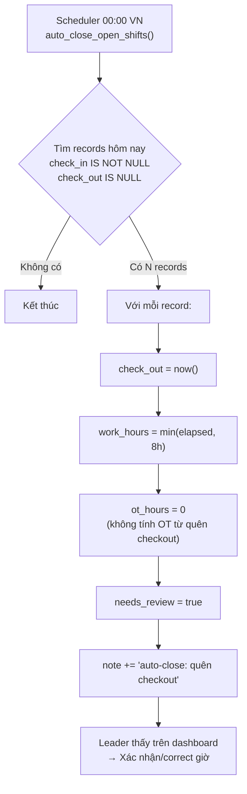
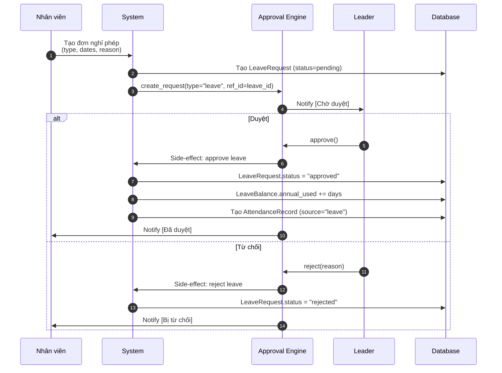
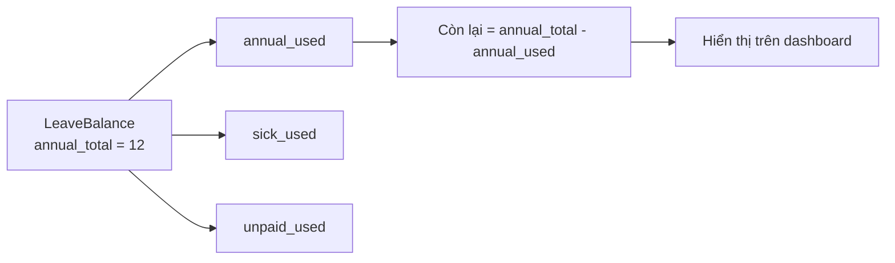
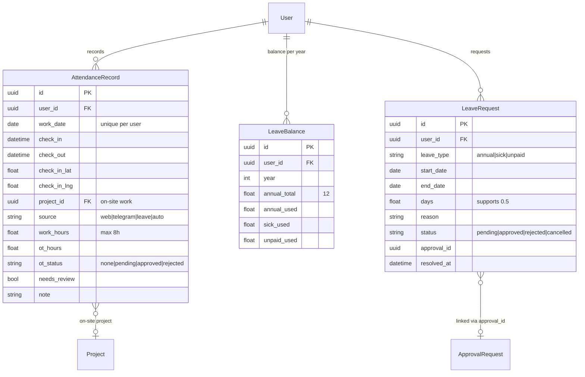

# Module: Attendance & Leave (Chấm công & Nghỉ phép)

## Overview

The Attendance & Leave module manages employee check-in/out (both office and construction site), leave requests with approval workflows, overtime tracking, and feeds data to the Payroll engine. It enforces 1 record per user per day and handles edge cases like forgotten checkouts.

## Use Case Diagram

```mermaid
graph TB
    subgraph Actors
        Employee["Nhân viên"]
        LeaderActor["Leader"]
        AdminActor["Admin"]
        SystemActor["Hệ thống"]
        AccountantActor["Kế toán"]
    end

    subgraph UseCases["Attendance Use Cases"]
        UC1["Check-in (web/Telegram)"]
        UC2["Check-out"]
        UC3["Xem bảng chấm công tháng"]
        UC4["Sửa giờ công (leader)"]
        UC5["Đăng ký tăng ca"]
        UC6["Duyệt tăng ca"]
        UC7["Tự đóng ca quên checkout"]
        UC8["Xác nhận ca cần review"]
    end

    subgraph LeaveUseCases["Leave Use Cases"]
        UC9["Tạo đơn nghỉ phép"]
        UC10["Duyệt/từ chối nghỉ phép"]
        UC11["Xem số dư phép năm"]
        UC12["Hủy đơn nghỉ phép"]
    end

    Employee --> UC1
    Employee --> UC2
    Employee --> UC3
    Employee --> UC5
    Employee --> UC9
    Employee --> UC12

    LeaderActor --> UC4
    LeaderActor --> UC6
    LeaderActor --> UC8
    LeaderActor --> UC10

    SystemActor --> UC7
    AccountantActor --> UC3
    AdminActor --> UC3
```

## Attendance Flow

## Auto-Close Forgotten Checkout

## Attendance Rules

| Rule | Description |
|------|-------------|
| 1 record/user/day | Check-in lần đầu tạo record, các lần sau bỏ qua |
| work_hours = min(elapsed, 8h) | Tối đa 8h công/ngày |
| ot_hours = elapsed - 8h | Chỉ tính nếu >= 0.5h |
| OT needs approval | ot_status = "pending" until leader approves |
| Period locked | Kỳ lương approved/paid → từ chối mọi sửa đổi |
| Forgotten checkout | Job đêm tự đóng 8h, needs_review = true |
| Source tracking | web / telegram / leave / auto |

## Leave Types

| Type | Vietnamese | Salary | Quota |
|------|-----------|--------|-------|
| `annual` | Phép năm | Có lương | 12 ngày/năm (theo luật) |
| `sick` | Phép ốm | BHXH chi trả | Theo quy định BHXH |
| `unpaid` | Không lương | Không | Không giới hạn |

## Leave Request Flow

## Leave Balance Calculation

## Data Model

## Month Summary (for Payroll)

The `month_summary()` function computes:

| Field | Description |
|-------|-------------|
| `records` | Total attendance records in month |
| `work_days` | Days with work_hours > 0 |
| `work_days_fraction` | Sum of (hours/8), capped at 1.0 per day |
| `total_hours` | Sum of all work_hours |
| `ot_approved_hours` | Sum of OT hours where ot_status = "approved" |
| `needs_review` | Count of records needing leader review |

## API Endpoints

| Method | Endpoint | Description | Roles |
|--------|----------|-------------|-------|
| POST | `/attendance/checkin` | Check-in (GPS optional) | All employees |
| POST | `/attendance/checkout` | Check-out | All employees |
| GET | `/attendance/today` | Today's record | All employees |
| GET | `/attendance/month?period=YYYY-MM` | Monthly summary | All (own), Leader (team) |
| PUT | `/attendance/{id}` | Edit attendance | Leader, Admin |
| PUT | `/attendance/{id}/ot` | Approve/reject OT | Leader, Admin |
| GET | `/leaves/balance` | Leave balance | All employees |
| POST | `/leaves` | Create leave request | All employees |
| GET | `/leaves` | List leave requests | All (own), Leader (team) |
| PUT | `/leaves/{id}/cancel` | Cancel leave request | Requester |

## Frontend Pages

- `/attendance` — Check-in/out button + today's status + monthly calendar
- `/attendance/team` — Team attendance overview (Leader/Accountant)
- `/leaves` — Leave request form + history + balance

## Tags

#module #attendance #leave #cham-cong #nghi-phep #jama-home
