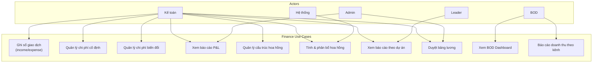
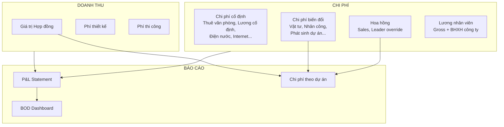
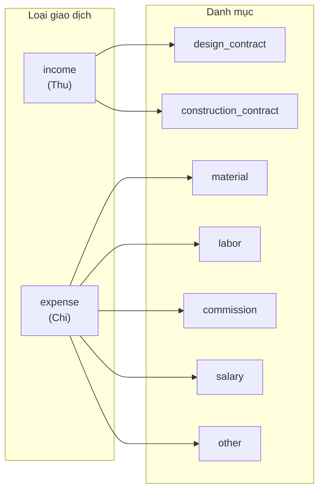
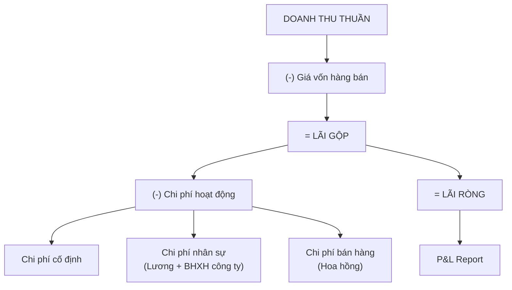
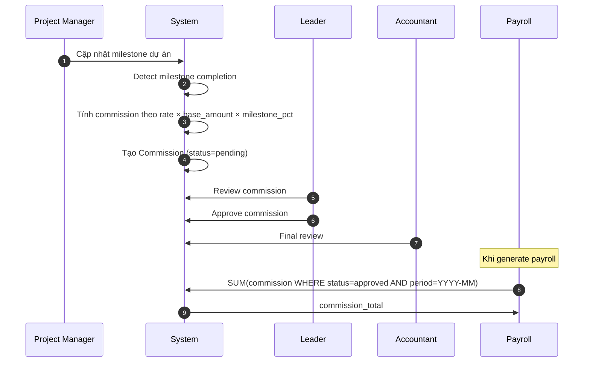
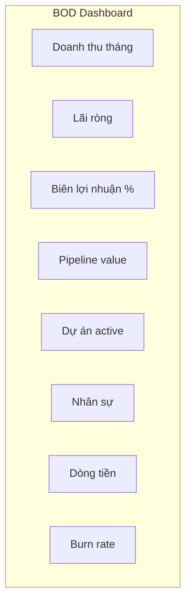
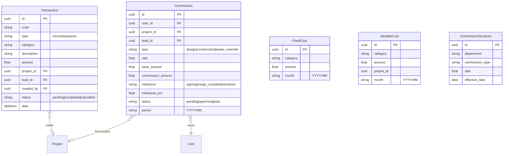

# Module: Finance & Accounting (Tài chính & Kế toán)

## Overview

The Finance & Accounting module manages all financial transactions, commission structures, profit & loss reporting, fixed/variable cost tracking, and payroll-related accounting. It provides the Accountant role with tools to manage company finances and generate financial reports.

## Use Case Diagram

## Financial Data Flow

## Transaction Model

## Profit & Loss Structure

## Commission Structure

### Types

| Type | Vietnamese | Description |
|------|-----------|-------------|
| `design_commission` | HH Thiết kế | % trên giá trị HĐ thiết kế |
| `construction_commission` | HH Thi công | % trên giá trị HĐ thi công |
| `leader_override` | HH Leader | % override cho leader team |

### Milestones (Payment Schedule)

```mermaid
gantt
    title Lịch thanh toán hoa hồng theo milestone
    dateFormat X
    axisFormat %s%%

    section Milestones
    Ký hợp đồng (50%)       :done, m1, 0, 50
    Nghiệm thu phần thô (30%):active, m2, 50, 80
    Bàn giao (20%)          :m3, 80, 100
```

| Milestone | Vietnamese | Percentage |
|-----------|-----------|------------|
| `signing` | Ký hợp đồng | 50% |
| `rough_complete` | Nghiệm thu phần thô | 30% |
| `handover` | Bàn giao | 20% |

### Commission Flow

## Cost Management

### Fixed Costs (Chi phí cố định)

| Category Examples | Vietnamese |
|------------------|-----------|
| Office rent | Thuê văn phòng |
| Utilities | Điện, nước, internet |
| Software licenses | Phần mềm |
| Insurance | Bảo hiểm tài sản |

### Variable Costs (Chi phí biến đổi)

| Category Examples | Vietnamese |
|------------------|-----------|
| Materials | Vật tư |
| Labor | Nhân công |
| Transportation | Vận chuyển |
| Subcontractors | Thầu phụ |

## BOD Dashboard Metrics

## Data Model

## API Endpoints

| Method | Endpoint | Description | Roles |
|--------|----------|-------------|-------|
| GET | `/accounting/transactions` | List transactions | Accountant, Admin |
| POST | `/accounting/transactions` | Create transaction | Accountant |
| PUT | `/accounting/transactions/{id}` | Update transaction | Accountant |
| GET | `/accounting/pl?month=YYYY-MM` | P&L report | Accountant, Admin, Executive |
| GET | `/accounting/project/{id}` | Project financials | Accountant, PM, Leader |
| GET | `/fixed-costs` | List fixed costs | Accountant |
| POST | `/fixed-costs` | Create fixed cost | Accountant |
| GET | `/variable-costs` | List variable costs | Accountant |
| POST | `/variable-costs` | Create variable cost | Accountant |
| GET | `/commissions` | List commissions | Accountant, Admin |
| PUT | `/commissions/{id}/approve` | Approve commission | Leader, Accountant |
| GET | `/commission-structures` | List structures | Accountant |
| POST | `/commission-structures` | Create structure | Accountant |

## Frontend Pages

- `/finance` — Financial overview dashboard
- `/accounting` — Transaction ledger
- `/pl` — Profit & Loss report
- `/finance/fixed-costs` — Fixed cost management
- `/finance/variable-costs` — Variable cost management
- `/reports` — BOD executive reports

## Tags

#module #finance #accounting #commission #pnl #jama-home
