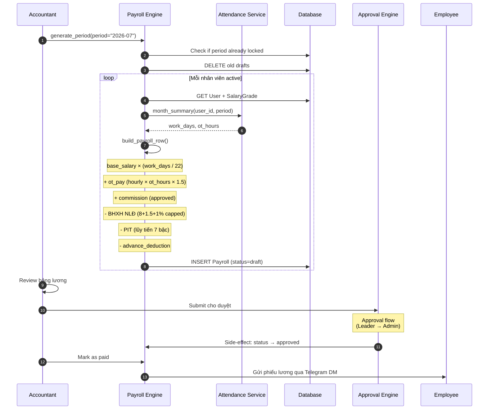
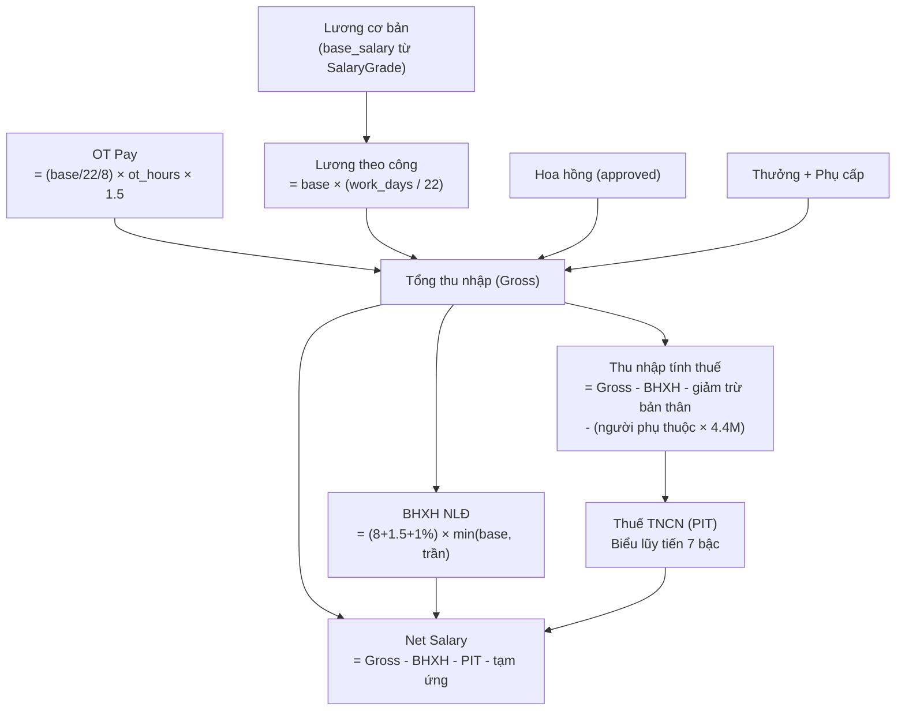
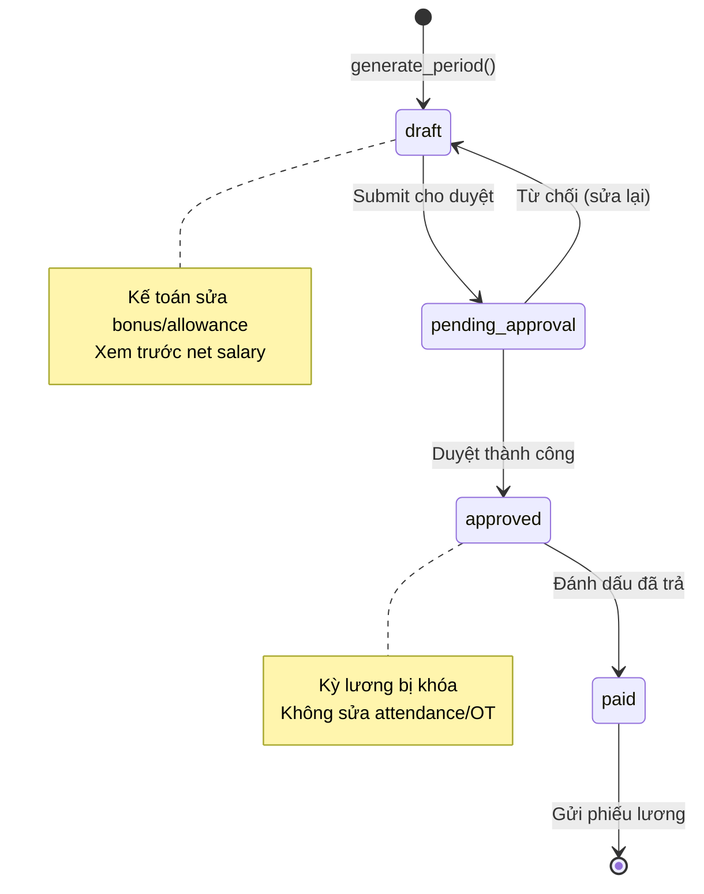
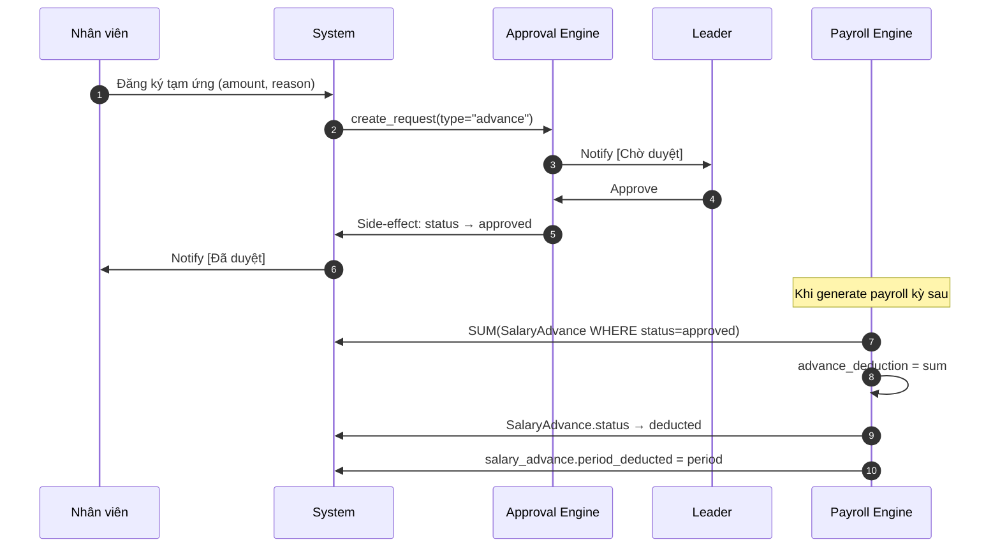
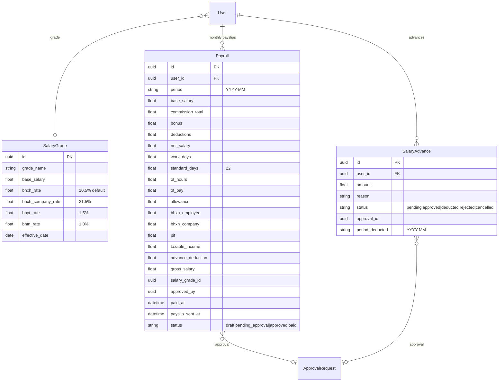

# Module: HR & Payroll (Nhân sự & Bảng lương)

## Overview

The HR & Payroll module manages employee profiles, salary grades, payroll generation with Vietnamese tax/insurance compliance (BHXH, BHYT, BHTN, PIT), salary advances, and payslip distribution. It integrates with Attendance for work days and with the Approval engine for payroll approval workflows.

## Use Case Diagram

```mermaid
graph TB
    subgraph Actors
        AccountantActor["Kế toán"]
        AdminActor["Admin"]
        EmployeeActor["Nhân viên"]
        LeaderActor["Leader"]
        SystemActor["Hệ thống"]
    end

    subgraph HRUseCases["HR Use Cases"]
        UC1["Quản lý hồ sơ nhân viên"]
        UC2["Thêm nhân viên mới"]
        UC3["Vô hiệu hóa / nghỉ việc"]
        UC4["Quản lý bậc lương"]
        UC5["Ủy quyền phê duyệt"]
        UC6["Xem danh sách nhân viên"]
    end

    subgraph PayrollUseCases["Payroll Use Cases"]
        UC7["Tạo bảng lương kỳ"]
        UC8["Duyệt bảng lương"]
        UC9["Gửi phiếu lương"]
        UC10["Xem phiếu lương cá nhân"]
        UC11["Đăng ký tạm ứng lương"]
        UC12["Duyệt tạm ứng"]
        UC13["Quản lý cấu trúc hoa hồng"]
    end

    AccountantActor --> UC1
    AccountantActor --> UC4
    AccountantActor --> UC7
    AccountantActor --> UC8
    AccountantActor --> UC9
    AccountantActor --> UC13

    AdminActor --> UC2
    AdminActor --> UC3
    AdminActor --> UC6

    EmployeeActor --> UC10
    EmployeeActor --> UC11

    LeaderActor --> UC6
    LeaderActor --> UC12

    SystemActor --> UC7
```



## Roles (8 total)

| Role | Vietnamese | Department | Key Permissions |
|------|-----------|-----------|----------------|
| `admin` | Quản trị viên | EXEC | Full system access |
| `executive` | Giám đốc | EXEC | View all reports, dashboards |
| `leader` | Trưởng nhóm | SALES/DESIGN/PM | Team management, approve requests |
| `data_entry` | Nhân viên nhập liệu | SALES | CRM data entry |
| `accountant` | Kế toán | ACCT | Finance, payroll, accounting |
| `purchasing` | Thu mua | ACCT | Inventory, pricing |
| `designer` | Thiết kế viên | DESIGN | Design tasks |
| `pm` | Quản lý dự án | PM | Project management |

## Payroll Generation Flow



## Salary Computation Formula



## PIT Brackets (Vietnamese Personal Income Tax)

| Bracket | Taxable Income (VND/month) | Rate |
|---------|---------------------------|------|
| 1 | 0 - 5,000,000 | 5% |
| 2 | 5,000,001 - 10,000,000 | 10% |
| 3 | 10,000,001 - 18,000,000 | 15% |
| 4 | 18,000,001 - 32,000,000 | 20% |
| 5 | 32,000,001 - 52,000,000 | 25% |
| 6 | 52,000,001 - 80,000,000 | 30% |
| 7 | > 80,000,000 | 35% |

## Deductions

| Deduction | Rate | Cap |
|-----------|------|-----|
| BHXH (Social Insurance) - Employee | 8% | Trần lương BHXH (46.8M default) |
| BHYT (Health Insurance) - Employee | 1.5% | Same cap |
| BHTN (Unemployment) - Employee | 1% | Same cap |
| BHXH - Company | 21.5% | Same cap |
| Personal deduction | 11,000,000 VND/month | Configurable |
| Dependent deduction | 4,400,000 VND/person/month | Configurable |

## Payroll Status Flow



## Salary Advance Flow



## Payslip Format (Telegram DM)

```
Phiếu lương kỳ 2026-07 — Nguyễn Văn A

Lương cơ bản: 15,000,000đ
Công thực tế: 22/22 ngày
Tăng ca (8h): +1,363,636đ
Hoa hồng: +2,500,000đ
Tổng thu nhập (gross): 18,863,636đ

BHXH/BHYT/BHTN: -1,575,000đ
Thuế TNCN: -836,364đ
Trừ tạm ứng: -3,000,000đ

THỰC LĨNH: 13,452,272đ

Phiếu lương bảo mật — vui lòng không chia sẻ.
```

## Data Model



## API Endpoints

| Method | Endpoint | Description | Roles |
|--------|----------|-------------|-------|
| GET | `/hr/employees` | List employees | Admin, Accountant, Leader |
| POST | `/hr/employees` | Create employee | Admin |
| PUT | `/hr/employees/{id}` | Update employee | Admin |
| PUT | `/hr/employees/{id}/resign` | Mark resignation | Admin |
| POST | `/hr/employees/{id}/undo-resign` | Undo resignation | Admin |
| GET | `/salary-grades` | List salary grades | Admin, Accountant |
| POST | `/salary-grades` | Create salary grade | Admin |
| PUT | `/salary-grades/{id}` | Update salary grade | Admin |
| GET | `/payroll?period=YYYY-MM` | List payroll records | Accountant, Admin |
| POST | `/payroll/generate?period=YYYY-MM` | Generate payroll | Accountant |
| PUT | `/payroll/{id}` | Update bonus/allowance | Accountant |
| POST | `/payroll/submit?period=YYYY-MM` | Submit for approval | Accountant |
| POST | `/payroll/{id}/pay` | Mark as paid | Accountant |
| POST | `/payroll/send-payslips?period=YYYY-MM` | Send via Telegram | Accountant |
| GET | `/payroll/me?period=YYYY-MM` | My payslip | All employees |
| POST | `/salary-advances` | Request advance | All employees |
| GET | `/salary-advances` | List advances | All (own), Accountant (all) |

## Frontend Pages

- `/hr` — Employee directory
- `/hr/salary-grades` — Salary grade management
- `/payroll` — Payroll period management
- `/payroll/me` — My payslip

## Tags

#module #hr #payroll #salary #tax #bhxh #jama-home
