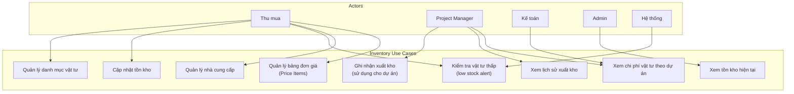
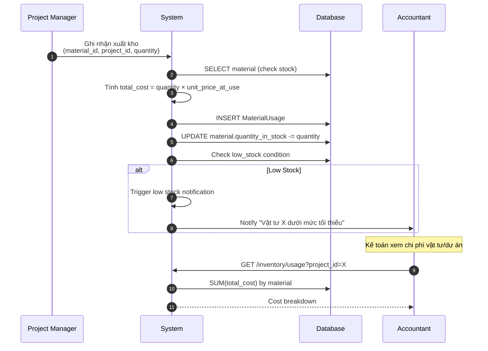
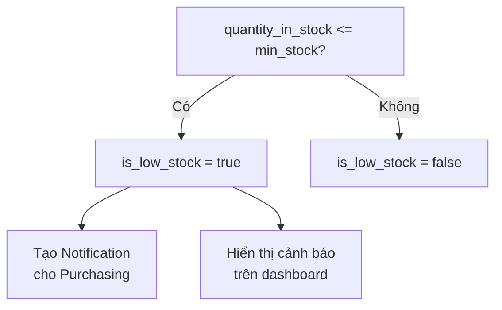
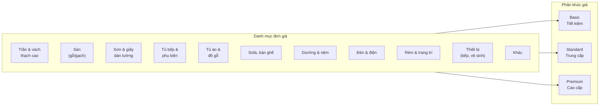
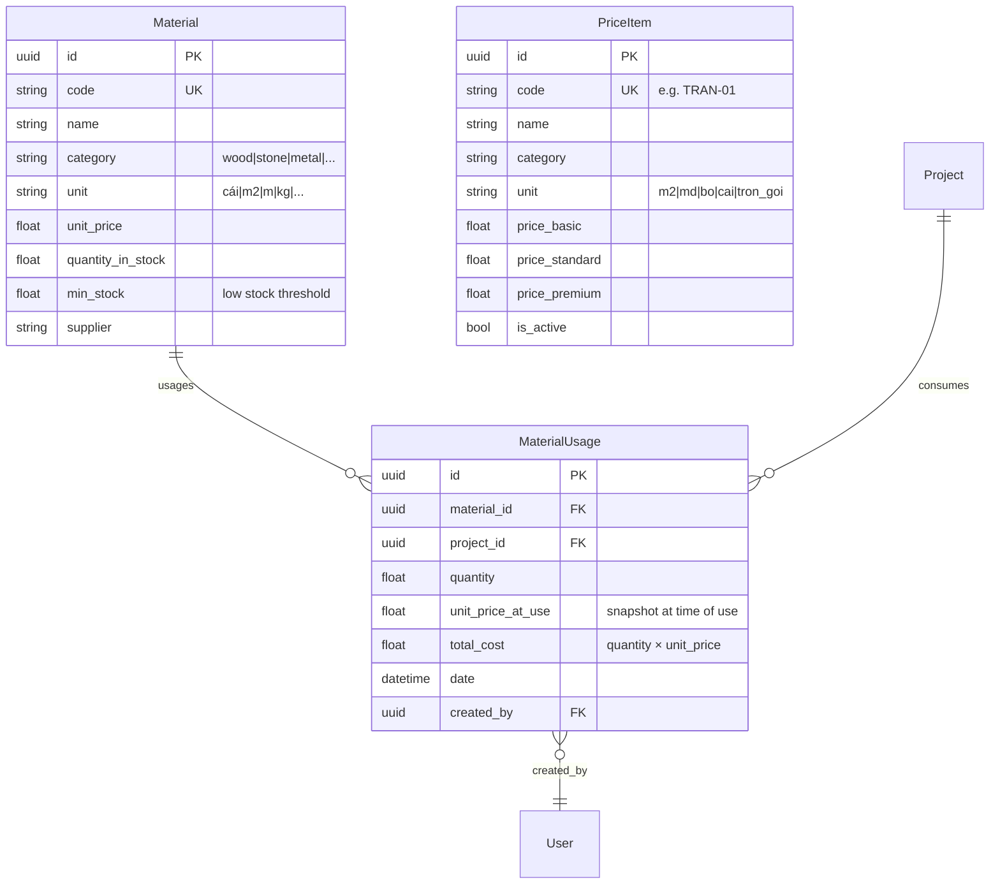

# Module: Inventory Management (Quản lý Vật tư)

## Overview

The Inventory Management module tracks construction and design materials, manages stock levels, records material usage per project, and provides low-stock alerts. It supports the purchasing department in maintaining adequate supplies for ongoing projects.

## Use Case Diagram

## Material Categories

| Category | Vietnamese | Unit Examples |
|----------|-----------|---------------|
| `wood` | Gỗ | m2, tấm |
| `stone` | Đá | m2 |
| `metal` | Kim loại | kg, m |
| `paint` | Sơn | lít, hộp |
| `electrical` | Điện | bộ, cuộn |
| `plumbing` | Nước | bộ, m |
| `furniture` | Nội thất | bộ, cái |
| `fabric` | Vải | m, cuộn |
| `glass` | Kính | m2, tấm |
| `general` | Tổng hợp | cái |

## Units

| Unit | Vietnamese | Description |
|------|-----------|-------------|
| `cái` | Cái | Piece |
| `m2` | Mét vuông | Square meter |
| `m` | Mét | Meter (length) |
| `kg` | Kilogram | Weight |
| `tấm` | Tấm | Sheet/panel |
| `bộ` | Bộ | Set |
| `cuộn` | Cuộn | Roll |
| `hộp` | Hộp | Box |
| `lít` | Lít | Liter |

## Material Usage Flow

## Low Stock Detection

## Price Items (Bảng đơn giá)

The PriceItem table serves the Instant Quote feature, providing standardized pricing across 3 segments.

### Price Categories

| Code | Vietnamese | Description |
|------|-----------|-------------|
| `tran_vach` | Trần & vách thạch cao | Ceiling & gypsum walls |
| `san` | Sàn | Flooring (wood/tile) |
| `son_giay` | Sơn & giấy dán tường | Paint & wallpaper |
| `tu_bep` | Tủ bếp & phụ kiện | Kitchen cabinets |
| `tu_ao_go` | Tủ áo & đồ gỗ nội thất | Wardrobes & woodwork |
| `sofa_ban_ghe` | Sofa, bàn ghế | Sofas & tables |
| `giuong_nem` | Giường & nệm | Beds & mattresses |
| `den_dien` | Đèn & điện | Lighting & electrical |
| `rem_trang_tri` | Rèm & trang trí | Curtains & decor |
| `thiet_bi` | Thiết bị | Appliances (kitchen, bath) |
| `khac` | Khác | Other (transport, labor) |

## Data Model

## API Endpoints

| Method | Endpoint | Description | Roles |
|--------|----------|-------------|-------|
| GET | `/inventory/materials` | List materials | Purchasing, PM, Admin |
| POST | `/inventory/materials` | Create material | Purchasing |
| PUT | `/inventory/materials/{id}` | Update material | Purchasing |
| GET | `/inventory/materials/low-stock` | Low stock alerts | Purchasing |
| POST | `/inventory/usage` | Record material usage | PM, Purchasing |
| GET | `/inventory/usage?project_id=X` | Usage by project | PM, Accountant |
| GET | `/inventory/usage?material_id=X` | Usage by material | Purchasing |
| GET | `/price-items` | List price items | All |
| POST | `/price-items` | Create price item | Purchasing |
| PUT | `/price-items/{id}` | Update price item | Purchasing |

## Frontend Pages

- `/inventory` — Material catalog + stock levels
- `/inventory/usage` — Material usage history
- `/inventory/low-stock` — Low stock alerts
- `/quote-tool` — Instant quote calculator (uses PriceItems)

## Tags

#module #inventory #materials #purchasing #pricing #jama-home
