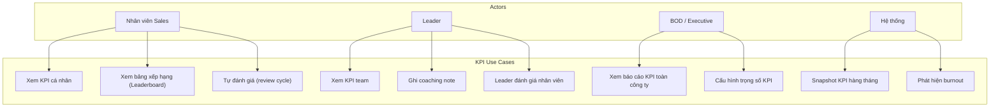
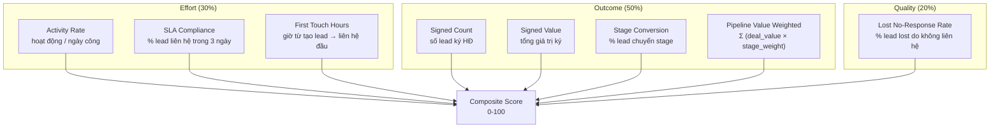
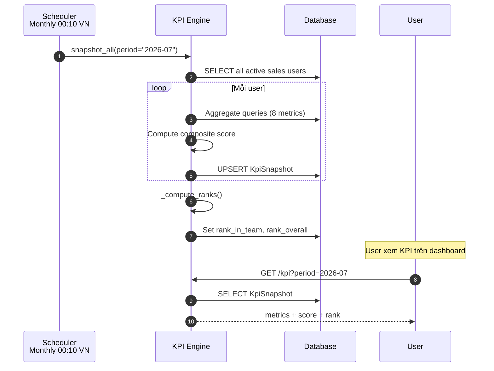
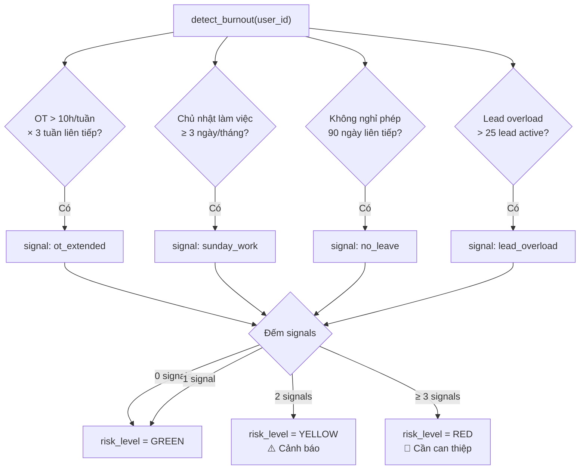
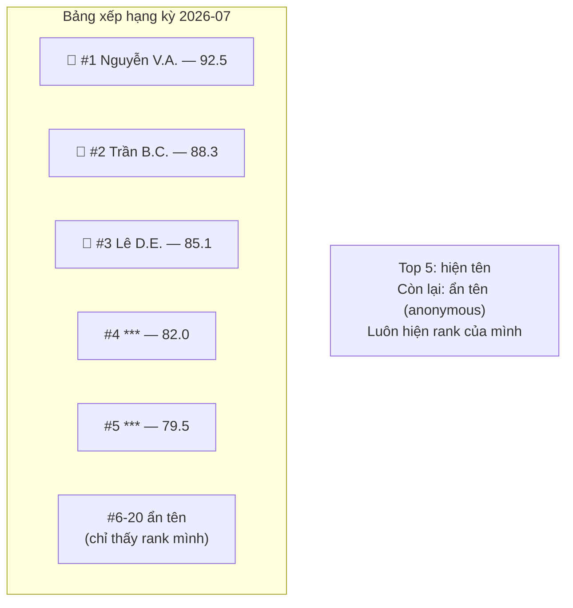
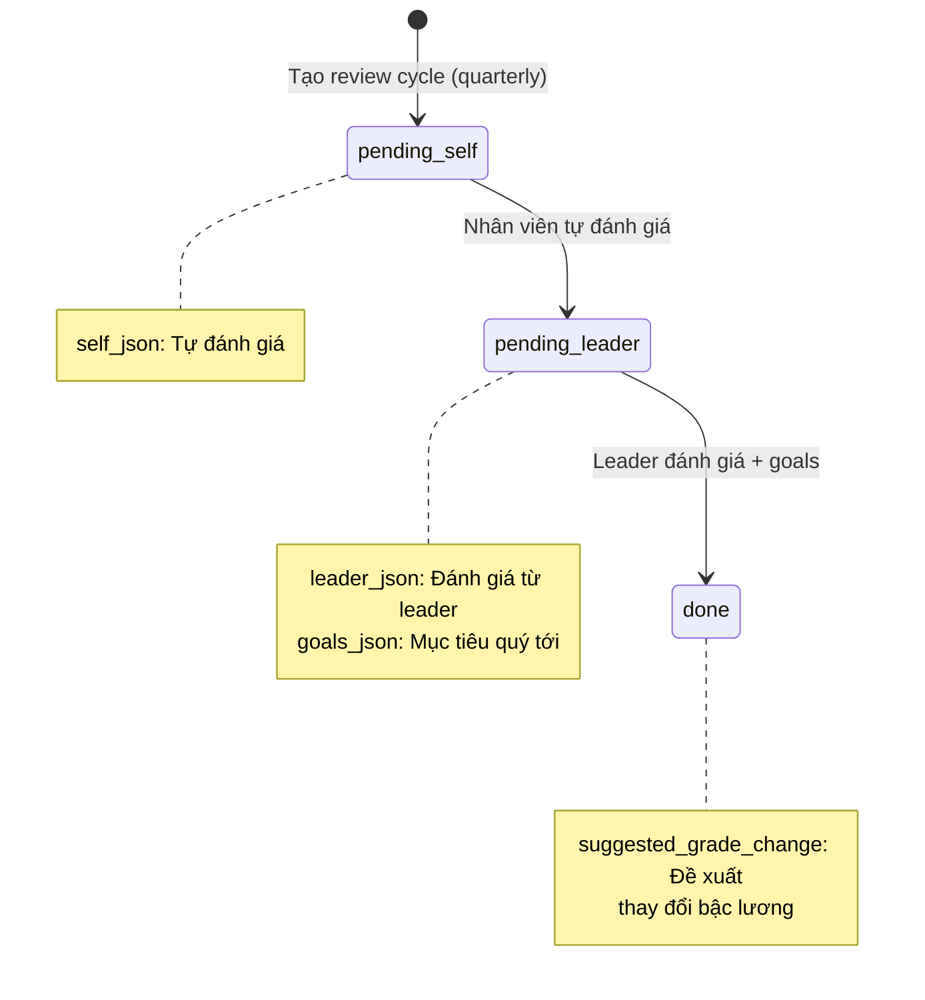
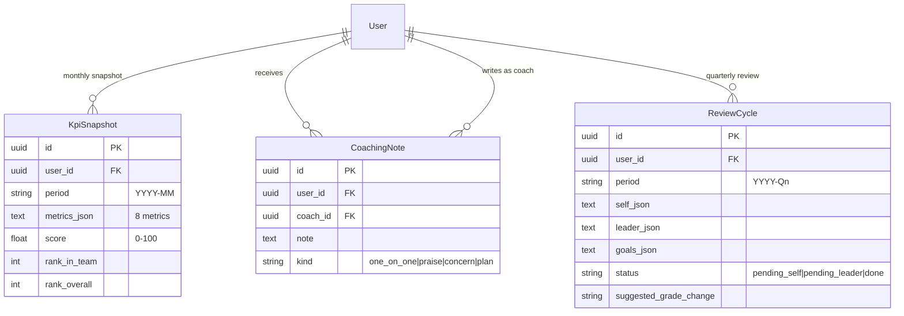

# Module: KPI & Performance (KPI & Hiệu suất)

## Overview

The KPI & Performance module computes 8 sales performance metrics using aggregate SQL, generates monthly snapshots with team/overall rankings, detects burnout signals, and maintains an anonymized leaderboard. It also supports coaching notes and quarterly review cycles.

## Use Case Diagram



## 8 KPI Metrics



### Metric Details

| # | Metric | Formula | Weight Category |
|---|--------|---------|----------------|
| 1 | Activity Rate | activities / work_days | Effort |
| 2 | SLA Compliance | % leads contacted within 3 days | Effort |
| 3 | First Touch Hours | median(hours from creation to first activity) | Effort |
| 4 | Signed Count | count(leads signed in period) | Outcome |
| 5 | Signed Value | sum(deal_value of signed leads) | Outcome |
| 6 | Stage Conversion | converted / new_leads × 100 | Outcome |
| 7 | Pipeline Value Weighted | Σ deal_value × stage_weight | Outcome |
| 8 | Lost No-Response Rate | lost_leads / total_leads × 100 | Quality |

### Stage Weights (for Pipeline Value Weighted)

| Stage | Weight |
|-------|--------|
| new | 0.10 |
| interested | 0.25 |
| survey_scheduled | 0.50 |
| potential | 0.75 |
| signed_design | 1.00 |

### Composite Score Formula

```
effort_score = min(100, activity_rate × 5 + sla_compliance × 0.5 + max(0, 48 - first_touch_hours) × 2)
outcome_score = min(100, signed_count × 20 + stage_conversion × 0.5 + pipeline_weighted / 100M)
quality_score = max(0, 100 - recall_rate × 10 - lost_no_response_rate)

score = effort_score × 0.30 + outcome_score × 0.50 + quality_score × 0.20
```

## KPI Snapshot Flow



## Burnout Detection



### Burnout Signals

| Signal | Vietnamese | Condition |
|--------|-----------|-----------|
| `ot_extended` | OT kéo dài | OT > 10h/tuần × 3 tuần liên tiếp |
| `sunday_work` | Làm CN | Làm việc chủ nhật ≥ 3 ngày/tháng |
| `no_leave` | Không nghỉ phép | 90 ngày liên tiếp không nghỉ |
| `lead_overload` | Quá tải lead | > 25 lead active cùng lúc |

### Risk Levels

| Level | Signals | Action |
|-------|---------|--------|
| GREEN | 0-1 | Bình thường |
| YELLOW | 2 | Cảnh báo leader, khuyến khích nghỉ ngơi |
| RED | >= 3 | Cần can thiệp, coaching note |

## Leaderboard



## Review Cycle



## Coaching Notes

| Kind | Vietnamese | Description |
|------|-----------|-------------|
| `one_on_one` | 1-on-1 | Meeting notes |
| `praise` | Khen ngợi | Positive feedback |
| `concern` | Lo ngại | Performance concern |
| `plan` | Kế hoạch | Improvement plan |

## Data Model



## API Endpoints

| Method | Endpoint | Description | Roles |
|--------|----------|-------------|-------|
| GET | `/kpi/me?period=YYYY-MM` | My KPI snapshot | All sales |
| GET | `/kpi/team?period=YYYY-MM` | Team KPI overview | Leader |
| GET | `/kpi/leaderboard?period=YYYY-MM` | Leaderboard (anonymized) | All sales |
| GET | `/kpi/burnout` | My burnout signals | All sales |
| GET | `/kpi/burnout/{user_id}` | User burnout check | Leader, Admin |
| POST | `/kpi/snapshot?period=YYYY-MM` | Trigger snapshot | Admin |
| POST | `/kpi/coaching` | Create coaching note | Leader |
| GET | `/kpi/coaching?user_id=X` | List coaching notes | Leader, Admin |
| GET | `/kpi/review?period=YYYY-Qn` | Review cycle | All |
| POST | `/kpi/review/self` | Submit self-evaluation | Employee |
| POST | `/kpi/review/leader` | Submit leader evaluation | Leader |

## Frontend Pages

- `/kpi` — My KPI dashboard (metrics + score + trend chart)
- `/kpi/leaderboard` — Anonymized leaderboard
- `/kpi/team` — Team comparison (Leader view)
- `/kpi/coaching` — Coaching notes management

## Tags

#module #kpi #performance #burnout #leaderboard #jama-home
