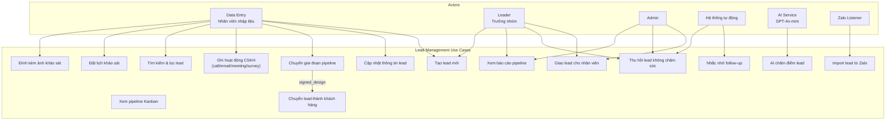
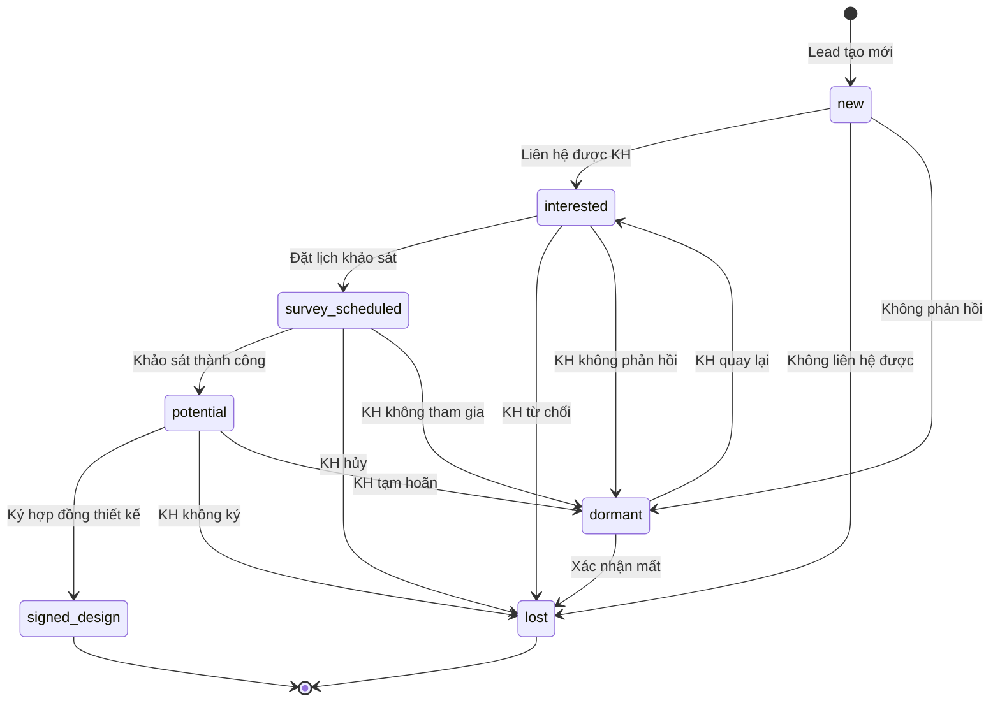
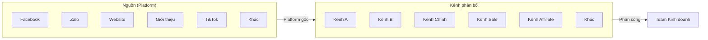
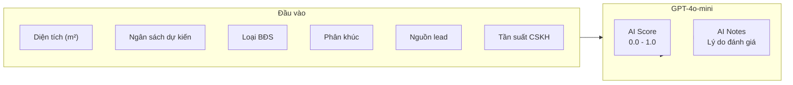
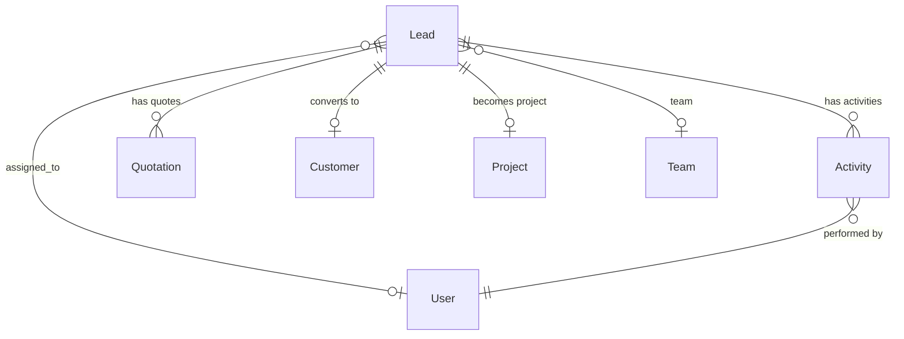

# Module: Lead Management (Quản lý Lead)

## Overview

The Lead Management module implements a 7-stage CRM pipeline for JAMA HOME's sales operations. Leads flow from capture through qualification to either conversion (signed design contract) or loss. The module includes AI-powered scoring, automated follow-up reminders, and lead recall mechanisms.

## Use Case Diagram



## Pipeline Stages



### Stage Definitions

| Stage | Vietnamese | Weight (KPI) | Description |
|-------|-----------|-------------|-------------|
| new | Mới | 10% | Lead vừa tiếp nhận, chưa liên hệ |
| interested | Quan tâm | 25% | Đã liên hệ, KH có nhu cầu |
| survey_scheduled | Đặt lịch khảo sát | 50% | KH đồng ý khảo sát thực địa |
| potential | Tiềm năng | 75% | Đã khảo sát, KH muốn ký |
| signed_design | Ký thiết kế | 100% | Ký HĐ, chuyển sang Project |
| lost | Mất | 0% | Không convert được |
| dormant | Tạm ngưng | 0% | KH tạm dừng, có thể quay lại |

### Valid Stage Transitions

```python
VALID_STAGE_TRANSITIONS = {
    "new": ["interested", "lost", "dormant"],
    "interested": ["survey_scheduled", "lost", "dormant"],
    "survey_scheduled": ["potential", "lost", "dormant"],
    "potential": ["signed_design", "lost", "dormant"],
    "signed_design": [],          # Terminal
    "lost": [],                   # Terminal
    "dormant": ["interested", "lost"],
}
```

## Lead Sources & Channels



## Activity Types

| Type | Vietnamese | Description |
|------|-----------|-------------|
| call | Gọi điện | Phone call to customer |
| email | Email | Email correspondence |
| meeting | Họp | In-person or virtual meeting |
| survey | Khảo sát | Site survey visit |
| note | Ghi chú | Internal note |
| stage_change | Chuyển stage | Automated log on stage transition |
| assignment | Phân công | Automated log on reassignment |

## Classifications

### Property Types
`townhouse` (Nhà phố) | `apartment` (Căn hộ) | `villa` (Biệt thự) | `office` (Văn phòng) | `shophouse` | `other`

### Property Classes
`luxury` (Cao cấp) | `mid_range` (Trung cấp) | `budget` (Tiết kiệm)

### Priorities
`low` (Thấp) | `medium` (Trung bình) | `high` (Cao) | `urgent` (Khẩn cấp)

### Contact Statuses
`reachable` (Liên hệ được) | `unreachable` (Không liên hệ được) | `wrong_number` (Sai số) | `no_need` (Không có nhu cầu) | `pending` (Chờ xác nhận)

## Automation Rules

```mermaid
flowchart TD
    A["Scheduler chạy hàng ngày 07:00 VN"] --> B{Lead active<br/>stage ∈ [new, interested,<br/>survey_scheduled, potential]?}

    B -->|"Có"| C{Ngày kể từ lần<br/>liên hệ cuối > N?}
    B -->|"Không"| Z["Bỏ qua"]

    C -->|"3 ngày (followup)"| D["Tạo Notification<br/>Nhắc CSKH"]
    C -->|"7 ngày (recall)"| E{Recall<br/>enabled?}
    C -->|"< 3 ngày"| Z

    E -->|"Có"| F["Thu hồi lead<br/>Giao cho sale khác"]
    E -->|"Không"| D

    D --> G["Push Telegram<br/>cho nhân viên phụ trách"]
    F --> H["Notify cả 2 nhân viên<br/>(cũ + mới)"]
    F --> I["Ghi AuditLog"]
```

## AI Lead Scoring

The AI scoring system evaluates leads based on multiple signals:



## Data Model Relationships



## API Endpoints

| Method | Endpoint | Description | Roles |
|--------|----------|-------------|-------|
| GET | `/leads` | List leads (filtered, paginated) | All sales |
| POST | `/leads` | Create new lead | data_entry, leader, admin |
| GET | `/leads/{id}` | Get lead detail | All sales |
| PUT | `/leads/{id}` | Update lead | assigned user, leader, admin |
| PUT | `/leads/{id}/stage` | Change pipeline stage | assigned user, leader, admin |
| POST | `/leads/{id}/activities` | Log activity | assigned user |
| POST | `/leads/{id}/assign` | Assign to user | leader, admin |
| POST | `/leads/{id}/survey` | Set survey date + photos | assigned user |
| POST | `/leads/{id}/convert` | Convert to customer + project | leader, admin |
| GET | `/leads/pipeline` | Kanban pipeline view | All sales |
| GET | `/leads/stats` | Pipeline statistics | leader, admin |

## Frontend Pages

- `/leads` — Pipeline Kanban board (drag-and-drop stage changes)
- `/leads?view=table` — Table view with filters
- `/leads?id={id}` — Lead detail page (info + activities + quotes)
- `/customers` — Customer list (converted leads)

## Tags

#module #crm #lead-management #pipeline #jama-home
