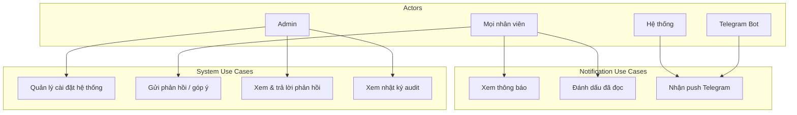
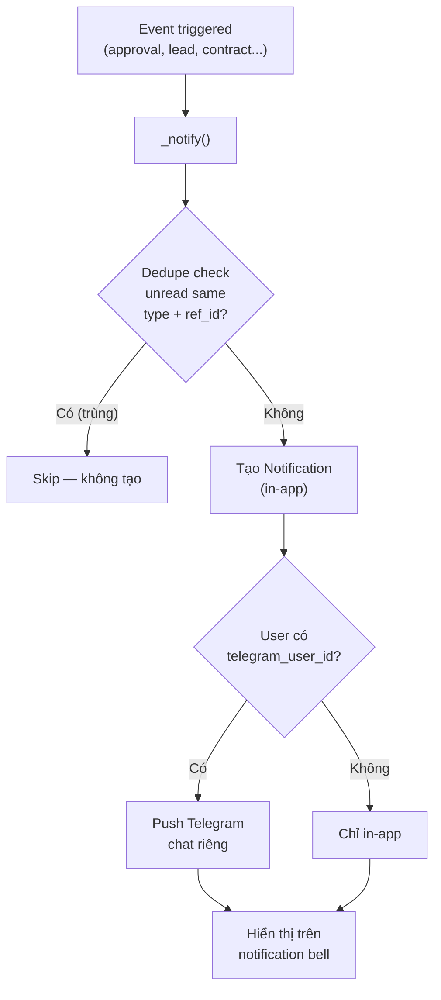
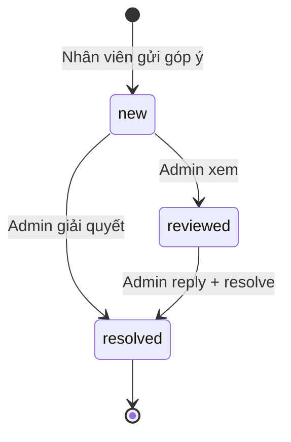
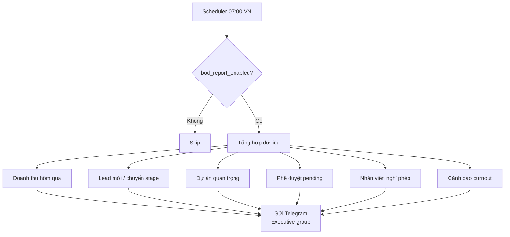
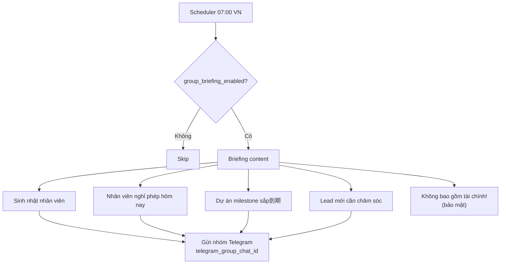
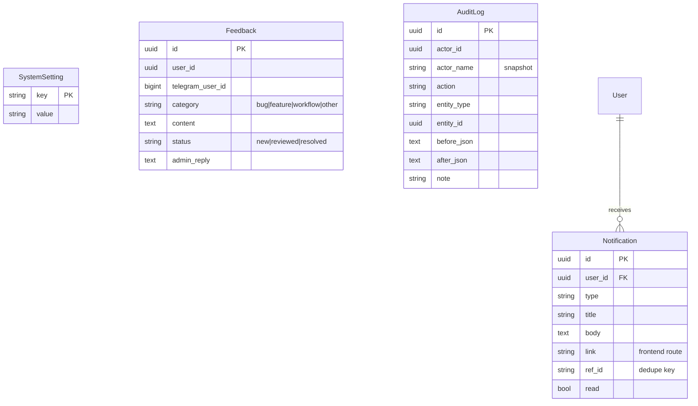

# Module: Notifications & System (Thông báo & Hệ thống)

## Overview

The Notifications & System module provides in-app notifications with deduplication, Telegram push integration, system settings management, employee feedback collection, and comprehensive audit logging for sensitive operations.

## Use Case Diagram

## Notification Types

| Type | Vietnamese | Trigger | Recipient |
|------|-----------|---------|-----------|
| `followup_reminder` | Nhắc CSKH | Lead không liên hệ > 3 ngày | Assigned sales |
| `lead_recalled` | Lead bị thu hồi | Lead recalled after 7 days inactive | Old + new owner |
| `lead_assigned` | Lead được giao | Leader assigns lead | New owner |
| `payment_reminder` | Nhắc thanh toán | Payment installment pending | Accountant |
| `contract_signed` | Khách ký HĐ | Contract signed | PM, Sales |
| `bod_report` | Báo cáo BOD | Daily report generated | Executive |
| `system` | Hệ thống | General system notifications | Targeted user |

## Notification Flow

## System Settings

Configurable automation parameters stored in `system_settings` table:

| Setting | Default | Description |
|---------|---------|-------------|
| `followup_reminder_days` | 3 | Nhắc CSKH sau N ngày không liên hệ |
| `lead_recall_days` | 7 | Thu hồi lead sau N ngày không chăm sóc |
| `lead_recall_enabled` | true | Bật/tắt tính năng thu hồi lead |
| `payment_reminder_days` | 3 | Nhắc thanh toán đợt pending sau N ngày ký HĐ |
| `bod_report_enabled` | true | Bật/tắt báo cáo BOD hàng ngày |
| `bod_report_hour` | 8 | Giờ gửi báo cáo (Asia/Ho_Chi_Minh) |
| `telegram_group_chat_id` | "" | Chat ID nhóm Telegram công ty |
| `group_briefing_enabled` | true | Gửi briefing nhóm hàng ngày |
| `pit_personal_deduction` | 11,000,000 | Giảm trừ gia cảnh (VND/tháng) |
| `pit_dependent_deduction` | 4,400,000 | Giảm trừ người phụ thuộc |
| `bhxh_salary_cap` | 46,800,000 | Trần lương đóng BHXH |

## Feedback System

### Feedback Categories

| Category | Vietnamese | Description |
|----------|-----------|-------------|
| `bug` | Lỗi phần mềm | Software bug report |
| `feature_request` | Đề xuất tính năng | Feature suggestion |
| `workflow_improvement` | Cải tiến quy trình | Process improvement |
| `other` | Khác | Other feedback |

## Audit Log

All sensitive operations are logged to `audit_logs` for compliance and traceability.

### Tracked Actions

| Action | Entity Type | Description |
|--------|------------|-------------|
| `user.create` | user | Tạo nhân viên mới |
| `user.role_change` | user | Thay đổi vai trò |
| `user.deactivate` | user | Vô hiệu hóa tài khoản |
| `user.resign` | user | Đánh dấu nghỉ việc |
| `user.undo_resign` | user | Hoàn tác nghỉ việc |
| `salary_grade.update` | salary_grade | Cập nhật bậc lương |
| `payroll.generate` | payroll | Tạo bảng lương |
| `payroll.submit` | payroll | Submit duyệt lương |
| `payroll.approve` | payroll | Duyệt bảng lương |
| `payroll.reject` | payroll | Từ chối bảng lương |
| `payroll.pay` | payroll | Đánh dấu đã trả |
| `attendance.edit` | attendance | Sửa giờ công |
| `ot.approve` | attendance | Duyệt tăng ca |
| `ot.reject` | attendance | Từ chối tăng ca |
| `leave.approve` | leave | Duyệt nghỉ phép |
| `leave.reject` | leave | Từ chối nghỉ phép |
| `approval.create` | approval | Tạo đơn phê duyệt |
| `approval.approve` | approval | Duyệt đơn |
| `approval.approve_step` | approval | Duyệt cấp |
| `approval.reject` | approval | Từ chối đơn |
| `approval.request_changes` | approval | Yêu cầu sửa đổi |
| `approval.resubmit` | approval | Nộp lại đơn |
| `approval.cancel` | approval | Hủy đơn |
| `approval.escalate` | approval | Escalate đơn |
| `approval.reassign_orphan` | approval | Tái phân đơn mồ côi |

## BOD Daily Report

Generated at 07:00 VN daily (configurable):

## Group Briefing

Daily briefing sent to company Telegram group (excluding financial data):

## Data Model

## API Endpoints

| Method | Endpoint | Description | Roles |
|--------|----------|-------------|-------|
| GET | `/notifications` | List my notifications | All |
| PUT | `/notifications/{id}/read` | Mark as read | All |
| PUT | `/notifications/read-all` | Mark all as read | All |
| GET | `/notifications/unread-count` | Unread count | All |
| GET | `/settings` | List system settings | Admin |
| PUT | `/settings/{key}` | Update setting | Admin |
| POST | `/feedback` | Submit feedback | All |
| GET | `/feedback` | List feedback | Admin |
| PUT | `/feedback/{id}` | Reply & resolve | Admin |
| GET | `/audit` | List audit logs | Admin |
| GET | `/audit?entity_type=X&entity_id=Y` | Audit for entity | Admin |

## Frontend Pages

- `/settings` — System settings management
- `/feedback` — Feedback management (Admin)
- `/audit` — Audit log viewer (Admin)

## Tags

#module #notifications #system #audit #feedback #settings #jama-home
