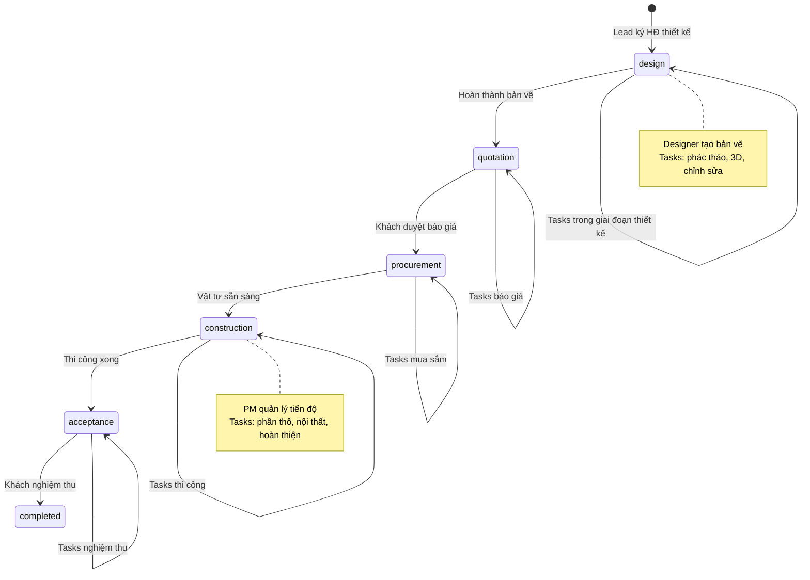
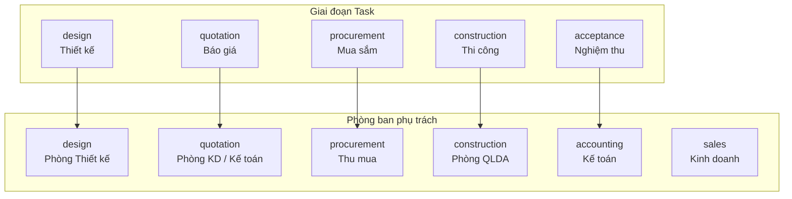
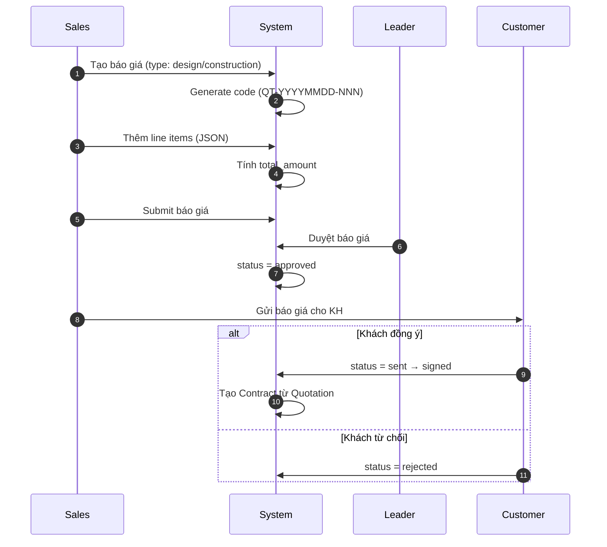
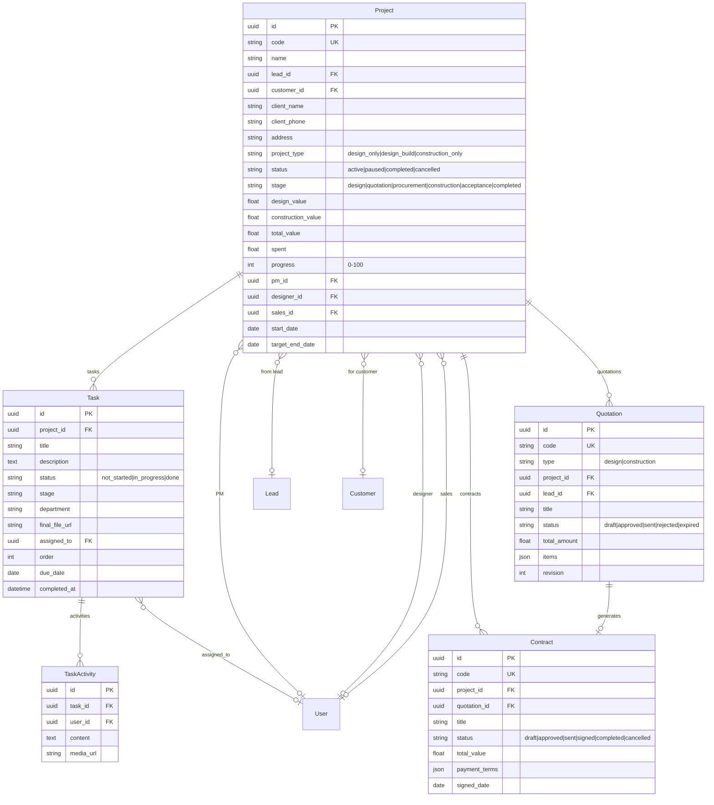

# Module: Projects (Dự án)

## Overview

The Projects module manages the lifecycle of interior design and construction projects, from contract signing through completion. It includes task management per project stage, team assignment (PM, Designer, Sales), financial tracking, and file management.

## Use Case Diagram

```mermaid
graph TB
    subgraph Actors
        PMActor["Project Manager"]
        DesignerActor["Designer"]
        SalesActor["Sales / Data Entry"]
        AccountantActor["Kế toán"]
        AdminActor["Admin"]
        LeaderActor["Leader"]
    end

    subgraph UseCases["Project Use Cases"]
        UC1["Tạo dự án mới<br/>(từ lead signed)"]
        UC2["Cập nhật thông tin dự án"]
        UC3["Quản lý task theo giai đoạn"]
        UC4["Giao task cho nhân viên"]
        UC5["Cập nhật tiến độ task"]
        UC6["Ghi hoạt động task<br/>(comment, file)"]
        UC7["Chuyển giai đoạn dự án"]
        UC8["Xem dashboard dự án"]
        UC9["Quản lý báo giá"]
        UC10["Quản lý hợp đồng"]
        UC11["Theo dõi chi phí dự án"]
        UC12["Upload file cuối cùng"]
    end

    PMActor --> UC1
    PMActor --> UC2
    PMActor --> UC3
    PMActor --> UC4
    PMActor --> UC7
    PMActor --> UC8
    PMActor --> UC11

    DesignerActor --> UC5
    DesignerActor --> UC6
    DesignerActor --> UC12

    SalesActor --> UC1
    SalesActor --> UC9

    AccountantActor --> UC10
    AccountantActor --> UC11

    AdminActor --> UC2
    AdminActor --> UC8

    LeaderActor --> UC8
```



## Project Lifecycle



## Project Types

| Type | Vietnamese | Description |
|------|-----------|-------------|
| `design_only` | Chỉ thiết kế | Design contract only |
| `design_build` | Thiết kế + Thi công | Full service |
| `construction_only` | Chỉ thi công | Construction contract only |

## Project Status

| Status | Vietnamese | Description |
|--------|-----------|-------------|
| `active` | Đang thực hiện | Active project |
| `paused` | Tạm ngưng | Temporarily paused |
| `completed` | Hoàn thành | Project completed |
| `cancelled` | Hủy | Project cancelled |

## Task Stages & Departments



## Task Status

| Status | Vietnamese |
|--------|-----------|
| `not_started` | Chưa bắt đầu |
| `in_progress` | Đang thực hiện |
| `done` | Hoàn thành |

## Quotation Flow



## Contract Payment Terms

Default: 4 installments at 25% each

```mermaid
gantt
    title Lịch thanh toán hợp đồng (mặc định 4 đợt)
    dateFormat X
    axisFormat %s%%

    section Installments
    Đợt 1: Đặt cọc (25%)           :done, p1, 0, 25
    Đợt 2: Nghiệm thu phần thô (25%):active, p2, 25, 50
    Đợt 3: Nghiệm thu nội thất (25%):p3, 50, 75
    Đợt 4: Bàn giao (25%)           :p4, 75, 100
```

| Installment | Vietnamese | Milestone | Default % |
|------------|-----------|-----------|-----------|
| 1 | Đợt 1 (Đặt cọc) | signing | 25% |
| 2 | Đợt 2 (Nghiệm thu phần thô) | rough_complete | 25% |
| 3 | Đợt 3 (Nghiệm thu nội thất) | interior_complete | 25% |
| 4 | Đợt 4 (Bàn giao) | handover | 25% |

## Data Model



## API Endpoints

| Method | Endpoint | Description | Roles |
|--------|----------|-------------|-------|
| GET | `/projects` | List projects | PM, Leader, Admin, Accountant |
| POST | `/projects` | Create project | PM, Admin |
| GET | `/projects/{id}` | Project detail | PM, Designer, Sales, Admin |
| PUT | `/projects/{id}` | Update project | PM, Admin |
| GET | `/projects/{id}/tasks` | List tasks | PM, Designer |
| POST | `/projects/{id}/tasks` | Create task | PM |
| PUT | `/tasks/{id}` | Update task | PM, assigned user |
| POST | `/tasks/{id}/activities` | Add task activity | assigned user |
| GET | `/quotations` | List quotations | Sales, Accountant |
| POST | `/quotations` | Create quotation | Sales |
| PUT | `/quotations/{id}` | Update quotation | Sales |
| GET | `/contracts` | List contracts | Accountant, PM |
| POST | `/contracts` | Create contract | Accountant |
| PUT | `/contracts/{id}/payment` | Update payment status | Accountant |

## Frontend Pages

- `/projects` — Project list (grid/table with filters)
- `/projects/{id}` — Project detail (info + tasks + timeline + finances)
- `/quotations` — Quotation management
- `/contracts` — Contract management
- `/bao-gia` — Instant quote tool

## Tags

#module #projects #tasks #quotations #contracts #jama-home
