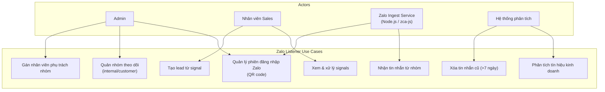
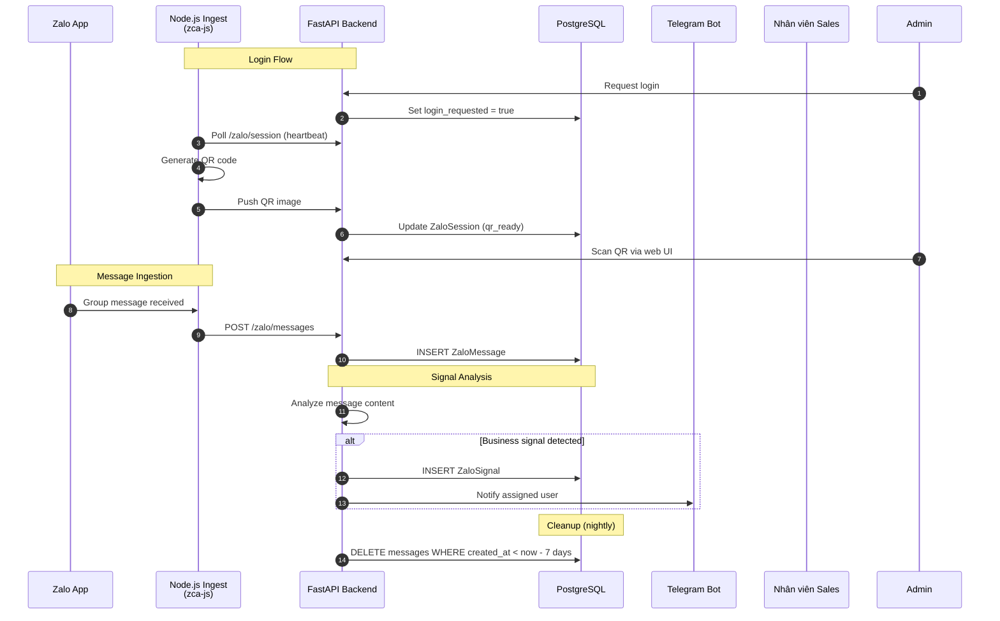
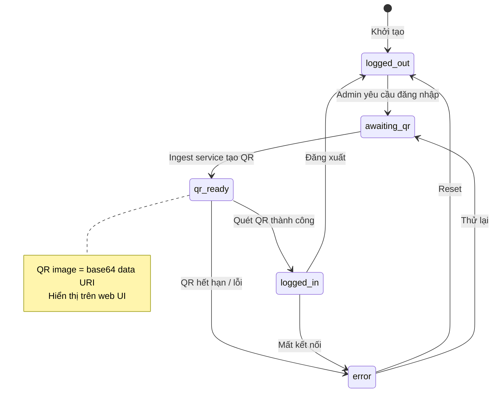
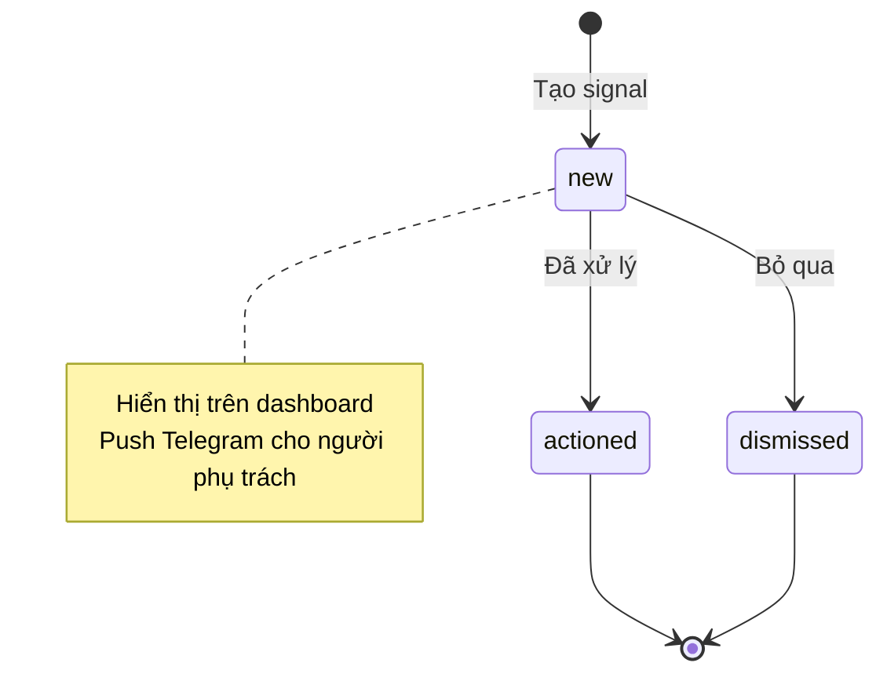
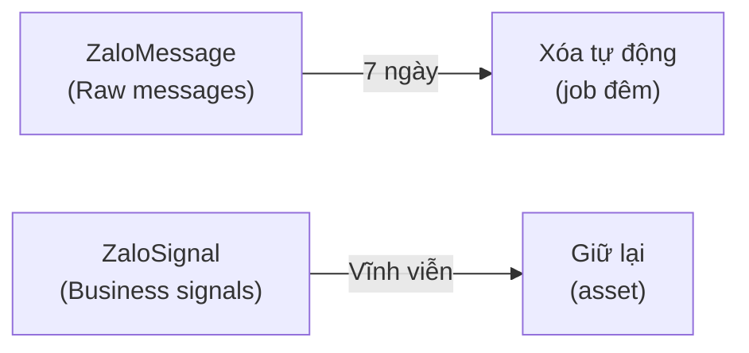
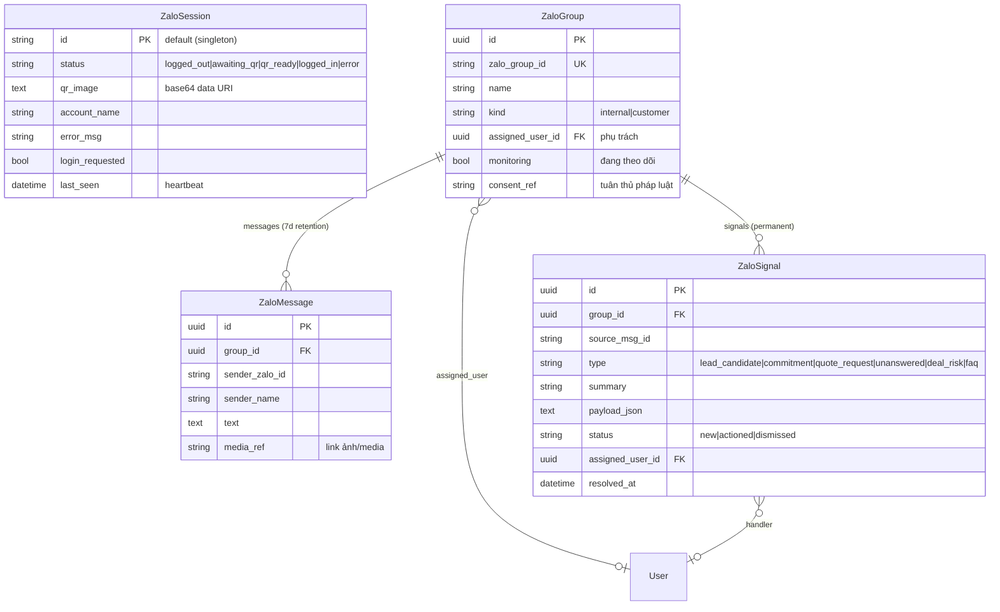

# Module: Zalo Listener (Trợ lý nghe nhóm Zalo)

## Overview

The Zalo Listener module ingests messages from Zalo groups (both internal and customer-facing) via a Node.js ingest service, analyzes them for business signals (lead candidates, commitments, quote requests), and surfaces actionable insights to the sales team. Raw messages are short-lived (7-day retention), while signals are permanent.

## Use Case Diagram

## Architecture

## Session States

## Signal Types

| Type | Vietnamese | Description | Example |
|------|-----------|-------------|---------|
| `lead_candidate` | Ứng viên tiềm năng | Message indicating potential customer | "Mình cần thiết kế căn hộ 80m2" |
| `commitment` | Cam kết | Customer commitment statement | "Ok em, mình ký hợp đồng nhé" |
| `quote_request` | Yêu cầu báo giá | Request for pricing | "Báo giá nội thất giúp mình" |
| `unanswered` | Chưa trả lời | Customer message not answered | Customer question > 24h without reply |
| `deal_risk` | Rủi ro deal | Risk of losing the deal | "Mình đang xem bên khác..." |
| `faq` | Câu hỏi thường gặp | Common question | "Thời gian thi công bao lâu?" |

## Signal Lifecycle

## Group Types

| Kind | Vietnamese | Description |
|------|-----------|-------------|
| `internal` | Nội bộ | Company internal groups |
| `customer` | Khách hàng | Customer-facing groups |

## Data Retention Policy

## Data Model

## API Endpoints

| Method | Endpoint | Description | Roles |
|--------|----------|-------------|-------|
| GET | `/zalo/session` | Get session status + QR | Admin |
| POST | `/zalo/session/login` | Request login | Admin |
| POST | `/zalo/session/logout` | Logout | Admin |
| PUT | `/zalo/session/heartbeat` | Ingest service heartbeat | Internal |
| PUT | `/zalo/session/qr` | Push QR image | Internal |
| GET | `/zalo/groups` | List monitored groups | Admin, Sales |
| POST | `/zalo/groups` | Add group to monitoring | Admin |
| PUT | `/zalo/groups/{id}` | Update group settings | Admin |
| POST | `/zalo/messages` | Ingest message | Internal (Ingest) |
| GET | `/zalo/signals` | List signals | Sales, Admin |
| PUT | `/zalo/signals/{id}` | Update signal status | Sales |
| POST | `/zalo/signals/{id}/create-lead` | Create lead from signal | Sales |

## Frontend Pages

- `/settings/zalo` — Zalo session management (QR login, status)
- `/settings/zalo/groups` — Group monitoring configuration
- `/zalo/signals` — Signal dashboard (new/actioned/dismissed)

## Tags

#module #zalo #listener #signals #messaging #jama-home
